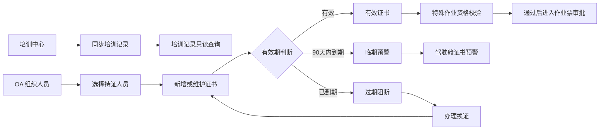

# 培训记录与证书管理模块 PRD

版本：v1.0（一期页面补充，2026-08-13）  
文档状态：业务规则基线

## 1. 模块定位

培训记录与证书管理模块为人员安全培训履历和资格证书提供统一查询、维护、预警及业务校验入口。本期不重复建设培训中心，不包含课程发布、培训计划、在线学习和考试；培训记录由培训中心同步后在安全管理平台只读展示。证书由安全管理平台维护或受控导入，并向特殊作业资格校验和管理驾驶舱提供当前有效状态。

页面沿用安全管理平台 PC 端整体布局，一级菜单为“培训与证书”，页面左侧仅设置“培训记录、证书管理”两个页签。

## 2. 核心业务流转图

## 3. 培训记录

### 3.1 页面显示

- 指标：记录总数、参训人数、累计学时、最近同步时间。
- 筛选：人员/课程/记录编号、培训类型、完成结果、完成日期、组织范围。
- 列表：记录编号、人员及组织、课程、培训类型、完成日期、学时、结果和来源。
- 详情：培训时间、方式、学时、成绩、结果、培训中心源记录编号和同步时间。

### 3.2 业务规则

1. OA 是人员、组织、部门、岗位和在职状态的唯一数据源，培训记录通过 OA 稳定人员 ID 关联人员。
2. 培训记录由培训中心同步，安全管理平台只读，不提供新增、编辑、删除、课程发布或考试入口。
3. 同步按“来源系统 + 来源记录编号”幂等处理；人员匹配失败、记录重复、字段缺失必须进入同步异常清单。
4. 培训中心记录修正后可覆盖安全管理平台展示字段，但必须保留同步批次、更新时间和变更日志。
5. 培训结果只按源系统记录展示，不由证书维护人员在安全管理平台修改。

## 4. 证书管理

### 4.1 页面显示与操作

- 指标：证书总数、有效、临期、已过期；点击指标带状态筛选下钻。
- 筛选：持证人员、证书名称、证书编号、状态、组织和有效期。
- 列表：人员及组织、证书名称、编号、发证日期、有效期、状态、来源和操作。
- 操作：查看详情、新增证书、编辑证书、办理换证；不提供物理删除。
- 详情：证书信息、附件、来源、历史版本、关联培训记录和关联特殊作业票。

### 4.2 业务规则

1. 持证人员必须从 OA 同步且处于在职状态的人员中选择；平台不得手工创建人员。
2. 证书名称、证书编号、发证日期、有效期为必填；有效期必须晚于发证日期。
3. 证书状态由系统按当前日期计算：超过有效期为“已过期”，距到期 90 天内为“临期”，其余为“有效”。预警天数作为系统参数配置，一期默认 90 天。
4. 换证生成新证书版本并归档原证书，不覆盖历史编号、有效期和附件；归档版本只读。
5. 已被作业票资格快照引用的证书不得删除。编辑人员、证书类型或编号等关键字段时应保留变更日志。
6. 特殊作业提交和开工前按“人员 + 作业要求的证书类型”读取当前有效证书。无证、过期或不满足规则必须阻断，并可跳转证书管理页处理。
7. 证书临期只预警，不自动阻断仍在有效期内的作业；证书过期必须阻断新提交和开工。已归档作业票继续保留当时的证书校验快照。

## 5. 权限

| 角色 | 培训记录 | 证书管理 |
|---|---|---|
| 平台管理员 | 查看同步结果和异常，不修改培训结果 | 维护证书字典、预警参数及查看台账，不代办特殊作业 |
| 二级单位安全管理 | 查看本单位培训记录 | 新增、编辑、换证和查看本单位证书 |
| 作业区负责人/班组长 | 查看本组织人员培训记录 | 查看本组织证书和临期/过期提示 |
| 岗位人员 | 查看本人培训记录 | 查看本人证书 |
| 管理查看人员 | 按组织范围只读 | 按组织范围只读 |

## 6. 数据对象与接口

核心对象包括：`training_record`、`training_sync_batch`、`person_certificate`、`certificate_version`、`certificate_attachment`、`certificate_change_log`。

| Method | 路径 | 说明 |
|---|---|---|
| GET | `/api/v1/training-records` | 按组织、人员、类型、结果和日期查询培训记录 |
| POST | `/api/v1/training-records/sync` | 从培训中心按批次同步培训记录 |
| GET | `/api/v1/training-sync-batches/{id}` | 查看同步结果和异常 |
| GET/POST | `/api/v1/certificates` | 查询/新增证书 |
| GET/PUT | `/api/v1/certificates/{id}` | 查看/维护证书详情 |
| POST | `/api/v1/certificates/{id}/renew` | 换证并归档原版本 |
| GET | `/api/v1/certificates/alerts` | 查询临期和过期证书 |
| POST | `/api/v1/certificates/qualification-check` | 按人员和作业规则返回资格校验结果 |

## 7. 页面清单

| 页面 | 路由 | 说明 |
|---|---|---|
| 培训记录 | `/training-certificates?tab=records` | 只读查询、详情和同步状态 |
| 证书管理 | `/training-certificates?tab=certificates` | 证书台账、状态筛选、维护和换证 |

## 8. 验收场景

1. 培训中心同步一条培训记录后，按人员和组织可查询，安全管理平台不能修改培训结果。
2. 新增证书时人员只能从 OA 组织人员选择，必填项或有效期错误时禁止保存。
3. 证书进入默认 90 天预警窗口后显示临期，并在驾驶舱下钻至临期证书列表。
4. 特殊作业引用人员过期证书时阻断；从阻断提示进入证书管理完成换证后，返回作业票重新校验通过。
5. 换证后原证书保留为只读历史版本，既有归档作业票仍展示办理时的资格校验快照。
