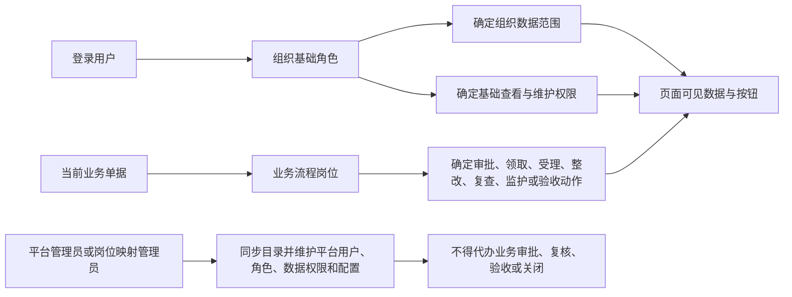
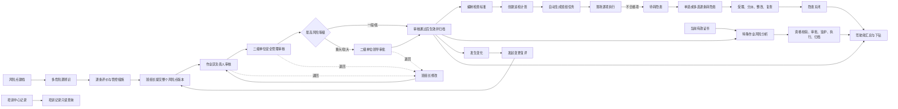

# 安全管理平台整体 PRD

版本：v1.5（新增相关方管理模块，2026-08-31）
适用范围：一期首批验收范围为铸锻件分公司、智能加工配送中心；造型作业区为铸锻件分公司的当前原型示例，其他单位和区域作为后续推广范围  
文档状态：最终规则基线

## 1. 产品定位与建设目标

安全管理平台面向集团、公司、分公司/作业区和现场岗位，建设“风险可识别、任务可执行、隐患可闭环、作业可管控、态势可穿透”的安全生产数字化平台。一期以铸锻件分公司、智能加工配送中心为试点，要求关键功能能够使用真实数据完成权限校验、状态流转、留痕和验收。

本期重点不是堆叠菜单，而是跑通以下业务链：

```
风险点建档、危险源辨识与分级管控
        ↓
风险措施输出巡检标准
        ↓
巡检任务现场执行
        ↓
发现隐患并登记
        ↓
受理、分派、整改、复查、闭环
        ↓
逾期事项督办建议（重大隐患作为可配置条件）
        ↓
特殊作业引用风险分析并执行资格、审批和监护闸门
        ↓
驾驶舱按权限汇总和下钻
```

## 2. 本期模块范围

| 序号 | 模块 | 本期职责 | 详细 PRD |
|---:|---|---|---|
| 1 | 风险管理 | 风险点、危险源、LEC、五类措施、责任岗位、按等级确定节点的系统内置 BPM 审批、版本、台账、四色图、告知卡 | [风险管理模块 PRD](./安全管理平台风险管理模块PRD.md) |
| 2 | 巡检任务管理 | 检查标准、计划、任务生成、现场执行、不合格转隐患 | [巡检任务管理 PRD](./安全管理平台巡检任务管理模块PRD.md) |
| 3 | 隐患治理与督办 | 隐患全生命周期和独立督办闭环 | [隐患治理与督办 PRD](./安全管理平台隐患治理与督办模块PRD.md) |
| 4 | 特殊作业管控 | 作业票、资质闸门、系统内置 BPM 分级审批、监护、执行、BPM 延期审批、验收归档 | [特殊作业管控 PRD](./安全管理平台特殊作业管控模块PRD.md) |
| 5 | 管理驾驶舱 | KPI、趋势、组织对比、风险图、动态信息和下钻 | [管理驾驶舱 PRD](./安全管理平台管理驾驶舱模块PRD.md) |
| 6 | 移动现场端 | 任务待办、巡检、随手拍、监护、作业过程、签到、消息和未完成作业票地图 | [移动现场端 PRD](./安全管理平台移动现场端PRD.md) |
| 7 | 培训记录与证书管理 | 培训中心记录只读查询、证书台账、临期预警、换证和特殊作业资格校验 | [培训记录与证书管理 PRD](./安全管理平台培训记录与证书管理模块PRD.md) |
| 8 | 目标职责 | OA 组织人员同步查询、平台用户、业务岗位映射、用户角色映射、角色默认范围、人员例外授权，以及岗位安全职责清单 | [目标职责模块 PRD](./安全管理平台目标职责模块PRD.md) |
| 9 | 安全知识库 | 法律法规、安全制度的目录分类、PDF 文件查看和内容检索 | [安全知识库模块 PRD](./安全管理平台安全知识库模块PRD.md) |
| 10 | 应急管理 | 应急预案台账、版本、原始文件查看和预案内容检索 | [应急管理模块 PRD](./安全管理平台应急管理模块PRD.md) |
| 11 | 相关方管理 | 相关方公司台账、人员、人员证书、违章记录和三次违章自动黑名单标记 | [相关方管理模块 PRD](./安全管理平台相关方管理模块PRD.md) |

本期不展开完整培训中心、设备设施、职业健康和原生移动 APP。移动现场端一期采用响应式 H5/企业微信工作台并纳入上线范围；培训记录建设只读查询页面并由培训中心同步，不建设课程、培训计划、在线学习或考试；证书建设台账维护、有效期预警、换证和作业票资格校验页面。目标职责不建设年度目标、指标权重、评分、逐级分解、履职填报、签字或 PDF，只建设组织权限基础能力和岗位安全职责清单。安全知识库一期管理法律法规和安全制度，应急管理独立管理应急预案；两者均以目录、原始文件查看和内容检索为主。相关方管理一期仅管理相关方台账、人员证书、违章和黑名单标记，不建设公司资质、准入、评价、合同、门禁或黑名单限制。

## 3. 用户、组织和权限

### 3.1 组织层级

```text
太重集团
└── 太原重工股份有限公司
    ├── 铸锻件分公司（一期试点）
    │   └── 造型作业区（当前原型示例）
    └── 智能加工配送中心（一期试点）

铸锻件分公司内的其他作业区通过组织配置扩展；除铸锻件分公司、智能加工配送中心外的单位不纳入一期首批验收范围。
```

### 3.2 核心角色

| 角色 | 主要权限 |
|---|---|
| 集团领导 | 查看集团驾驶舱、风险态势、隐患和督办下钻，不直接办理下属公司业务 |
| 集团监督检查 | 发起集团监督检查，查看授权范围内隐患与整改反馈，发起和关闭授权范围内督办；监督检查隐患审批跨系统委托 OA BPM |
| 集团专业检查 | 录入专业检查隐患台账、查看同一专业部门下所有人员录入的专业检查记录；提交即闭环，不得受理、分派、整改、复查、督办、审批或关闭 |
| 公司领导 | 查看本公司驾驶舱、重大风险、重大隐患和特殊作业审批 |
| 二级单位安全管理人员 | 审核全部风险点；一般/低风险审核后生效，较大/重大风险继续报二级单位领导；负责随手拍和集团监督检查隐患受理、作业审核、统计和归档 |
| 作业区负责人 | 审核班组长提交的本区域风险点，受理巡检来源隐患并负责整改复查，负责巡检计划、作业申请和现场组织 |
| 班组长 | 填报风险新增、变更和复评，接收退回并修改重提；关联风险点编制和发布检查标准；协调巡检、隐患整改和现场作业 |
| 岗位人员 | 执行巡检、隐患上报、整改反馈、作业负责人和监护确认 |
| 平台管理员 | 查看 OA 人员同步结果，维护角色、字典、参数和系统配置；不得在平台手工新增、修改或删除 OA 组织人员，不得代办任何业务审批、复核、验收或关闭 |
| 岗位映射管理员 | 将 OA 组织、人员和岗位映射为安全管理平台业务角色及流程岗位；不因配置权限获得业务办理权 |

角色模型统一采用“组织基础角色 + 业务流程岗位”：组织基础角色决定组织范围和基础操作，业务流程岗位决定风险审批、巡检执行、隐患受理/复查、督办和作业票审批等流程节点。平台管理员和岗位映射管理员均不得代办业务审批。

集团监督检查与集团专业检查为两个独立基础角色。集团专业检查提交后直接形成已闭环的专业检查隐患台账，不移交二级单位安全管理人员受理和分派；该角色可查看同一专业部门下的专业检查记录，不因录入或查看行为获得后续流程办理权。

### 3.3 关键审批与岗位规则

安全管理平台内的审批能力统一由系统内置 BPM 微服务提供。业务模块只提交业务单据、审批业务键和路由变量，并读取 BPM 返回的待办、状态、意见和结果；不得自行定义、推进或保存审批节点、审批路径、审批待办和审批状态机。集团监督检查是唯一例外：其审批不调用系统内置 BPM，而是跨系统调用 OA 内置 BPM 的流程启动入口，并将流程完整委托给 OA。

1. 风险点以整体版本为审批对象，危险源只完成评价和措施，不设置危险源独立审批。
2. 风险点基础信息只维护责任岗位，固定为班组长、分公司负责人、总经理、公司领导；风险编辑页不设置措施公共责任信息或三级管控责任填写区，具体办理人员按组织和岗位映射解析。
3. 风险新增、变更和复评均调用系统内置 BPM 微服务，不接入 OA。班组长填报并提交后，BPM 按风险等级依次生成作业区负责人、二级单位安全管理人员等审批任务。
4. 一般、低风险在二级单位安全管理人员审核通过后生效；较大、重大风险继续进入二级单位领导审批，批准后生效。
5. 任一审核节点退回时统一回到班组长。班组长修改并重新提交后，从作业区负责人审核重新开始，不从原退回节点继续。
6. BPM 微服务是审批路径、当前节点、办理岗位、办理人、意见、时间、结果和退回原因的唯一审批记录来源；风险模块保存 BPM 流程实例标识、当前审批摘要和最终结果，用于业务状态联动和展示。平台管理员不得替代业务岗位办理。
7. 首次双控报告导入先校验国标27类事故类型和每个危险源的必填管理措施，校验通过后作为历史版本直接生效，不走审批；导入文件、版本号、导入人、导入时间和数据校验结果必须留痕。
8. 每条危险源可以从国标27类事故类型中选择一项或多项；同一评价条件和措施下共用一次评价，条件、等级或措施明显不同时拆分危险源。五类措施界面将必填的管理措施置于工程技术措施之前。
9. 风险审核意见提供系统固定的通过类、退回类常用语，点击后带入文本域并允许修改，不单独建设审批语管理页面。

### 3.4 权限原则

1. 功能权限决定是否能新增、编辑、审核、批准、关闭。
2. 数据权限决定能查看哪些组织、区域和业务单据。
3. 集团可穿透查看，但不替代下属组织执行原业务流程；审批节点按系统岗位职责解析到具体人员。
4. OA 是组织、部门、人员、岗位和在职状态的唯一数据源。平台只同步和引用，不手工维护上述基础数据；业务办理记录必须保存办理时的人员、组织和岗位快照。
5. 安全业务角色和流程岗位仍在平台配置，通过 OA 稳定人员 ID、部门 ID 和岗位 ID 建立映射，不直接把 OA 岗位名称当作业务权限。
6. 企业微信只作为移动工作台入口和平台待办消息渠道，不作为组织人员主数据来源。待办接收人由 OA 稳定人员标识映射到企业微信接收身份；映射或消息投递失败不改变业务状态，进入重试和告警。
7. 安全管理平台产生的待办统一推送企业微信，消息携带安全管理平台业务链接。系统内置 BPM 审批待办由 BPM 微服务生成并推送；集团监督检查委托 OA BPM 后，其 OA 内部节点通知由 OA 负责，平台不重复生成。
8. OA 人员同步与 OA BPM 委托是两项独立集成：前者同步人员主数据，后者仅用于集团监督检查审批，不得互相替代或共享审批待办。
9. 所有审核、审批、关闭和发布动作必须记录操作人、时间、意见和前后状态。
10. 相关方管理以维护单位作为数据归属。集团、公司安全管理人员可跨单位查看相关方、人员、证书、违章和黑名单；各分子公司只维护本单位数据，跨单位查看不等于跨单位编辑。

### 3.5 OA 人员同步与待办边界

1. OA 人员同步范围固定为组织、部门、人员、岗位和在职状态；同步对象必须携带可长期引用的 OA 组织、人员和岗位标识。平台仅允许将这些标识用于用户启停、安全业务角色、业务流程岗位、数据范围和历史快照，禁止通过平台回写 OA 源数据。
2. 人员调岗、离职或同步失败时，平台保留上次成功同步结果和同步批次；离职人员停止有效访问，现有业务单据保留历史快照，不自动变更责任人。待转交事项由有权岗位显式转交并留痕。
3. 企业微信只承接两类能力：移动工作台进入平台、接收平台待办消息。企业微信入口身份和消息接收身份均须映射到 OA 稳定人员标识；未建立有效映射、人员非在职或投递失败时，不得把消息发送给其他人员，也不得自动完成、退回或转交待办。
4. 平台待办是安全管理平台与系统内置 BPM 的业务对象，PC 工作台、移动端和企业微信消息链接共用同一待办状态。企业微信消息已读、投递失败或链接失效都不改变待办状态。
5. 集团监督检查是唯一外部审批例外：OA BPM 内部节点待办由 OA 生成和通知，安全管理平台不创建镜像待办；仅在 OA 回传“驳回起草人”或最终结果后，按回传结果在平台创建后续业务待办或结束业务。

### 3.6 组织与权限判定图



## 4. 整体业务闭环

### 4.0 主业务闭环总图



### 4.1 风险到巡检

```text
风险点
  └─ 危险源
      └─ 管控措施（巡检项目关联并带出初始内容）
          └─ 巡检标准（独立版本，可由负责人调整）
              └─ 巡检计划
                  └─ 巡检任务
```

风险管理中的管控措施可在巡检模块中作为关联来源并带出初始内容。检查标准中的管控措施按每个危险源分别取“工程技术措施＋管理措施”，工程技术措施在前、管理措施在后，换行拼接，不跨危险源合并；不带入培训教育、个体防护及应急处置措施。一类为空时仅带出另一类，两类均为空时不补造措施，由负责人填写检查内容。初始检查内容按原措施逐条带出，允许调整，每条检查内容独立生成任务检查项。班组长关联本班组权限范围内的已生效风险点，调整检查表述、频次和证据要求并发布独立检查标准版本；其他角色按授权只读查看。修改不得反向覆盖已生效的风险措施，风险措施变化也不得自动覆盖已发布的检查标准。同时选择多个风险点时，按风险点分别生成独立检查标准草稿，不合并且不覆盖已有草稿。检查标准列表和详情显示当前版本及变更次数。

巡检任务只能由已发布巡检计划按周期自动生成，不设置“临时下发”入口。计划编制时先选择计划类型，周期紧随其下，并集中配置自动派发时间及按周期显示的星期/每月第几日参数；生效开始和结束字段按周期切换维度：每日为日期、每周为周边界日期、每月为月份、每季度为季度首月。计划先选择执行班组，再填写检查范围；检查范围默认由执行班组带出，允许用户修改。引用已发布检查标准时，列表同时展示风险点位置。计划只绑定执行班组，不再配置“可领取岗位”；开始日期和结束日期均计入计划有效期，每日、每周、每月、每季度按各自规则计算生成日期，页面实时展示首次生成日期和预计任务数，有效期内没有生成日期时不得保存。任务下发给整个班组，班组内首位领取人员成为实际执行人并锁定任务；领取后不提供解锁或退回公共任务池。班组长可在有因（请假、换班、设备/区域调整等）时转交，也可标记未检，以上操作均必须填写原因并保留相关操作记录。工部或作业区下未划分班组时，平台为任务执行创建一个默认班组，不新增 OA 组织。计划可引用多份已发布检查标准，各标准检查内容逐条展开为独立任务项，每个计划每周期只生成一份任务。打开执行页面不立即改变状态，完成现场位置确认后才进入“执行中”。同一计划同一周期必须幂等生成；已有历史任务的计划只能停用，不能删除，停用计划和未检任务均必须填写原因。

### 4.2 巡检到隐患

```text
巡检任务执行
    ├─ 合格 → 结果留痕
    └─ 不合格 → 填写说明并按配置上传照片 → 待转隐患 → 单选/多选逐条登记
```

检查结果只允许合格、不合格；说明和照片为两个独立字段，不合格时说明必填，照片是否必拍按检查标准逐条配置。提交结果后先关闭执行弹框并重新查询任务；存在不合格且未转换项时，自动打开与任务列表“转隐患（N）”相同的弹框，不存在时回到任务列表。每条不合格检查结果分别生成一条隐患，隐患标题直接取对应巡检说明；同一任务存在多条不合格结果时，可勾选单条或多条处理。提交后自动弹框和任务列表入口共用同一待转清单，关闭弹框不丢失待转状态；“查看结果”展示全部检查项及隐患编号，转隐患页面只展示不合格且未转换的检查项。系统按“巡检任务 + 检查项”防止重复建单；隐患关闭不改变原巡检结果。巡检、随手拍、集团专业检查、集团监督检查四类来源在隐患主单中分流记录：普通隐患受理可以“受理并分派”或填写原因后“不受理关闭”；整改反馈只填写一项整改情况说明并上传整改后照片；复查由作业区负责人办理。集团专业检查一期使用独立新增页面，完整登记发现、整改、闭环和考核信息后直接形成已闭环台账，不展示或发起 OA，仅允许同一专业部门查看；集团监督检查跨系统调用 OA 内置 BPM 流程启动入口并完整委托 OA 办理，批准回传考核人和考核金额后进入受理整改；巡检隐患不计奖励，随手拍奖励规则本轮保持不变。

### 4.3 隐患到督办

```text
逾期隐患 → 督办建议 → 授权人员确认发起 → 接收 → 阶段反馈 → 督办关闭
        │
        └── 原隐患仍独立执行整改和复查
```

### 4.4 风险到特殊作业

```text
作业申请 → 引用风险点/危险源 → 资格校验 → 冻结作业票快照
       → 系统内置 BPM 分级审批 → 多监护人确认 → 位置校验和开工照片 → 开工 → 过程照片 → 暂停/恢复 → 完工 → 验收 → 归档
       ↘ 许可超时 → 延期申请并复核人员/监护/地点/环境/措施 → 系统内置 BPM 延期审批 → 批准前阻断继续作业 → 批准后清空原确认并重新监护确认 → 恢复
```

风险管理中的作业风险分析措施作为作业票的初始安全措施，作业票可以补充现场措施，但不得删除必选风险控制项。监护人支持多人选择并与作业人员分开维护；一级动火初次许可不超过 8 小时，每次延期同样最多延长 8 小时。

### 4.5 业务到移动现场端

```text
统一身份与岗位权限 → 本人任务/消息
    ├─ 巡检任务 → 现场执行 → 异常转隐患
    ├─ 隐患随手拍 → 受理、整改和复查
    ├─ 特殊作业 → 签到、多监护确认、位置校验、开工/过程照片、暂停/恢复和完工
    └─ 未完成作业票 → 现场作业地图
```

移动现场端复用各业务模块正式数据和状态机，不建立独立的移动端业务台账。PC 工作台与移动任务中心读取同一待办对象和状态，任一端的业务动作实时回写，另一端刷新后必须得到一致的责任人、状态、截止时间和下一步动作。所有平台待办均推送企业微信；用户点击企业微信消息后进入安全管理平台对应业务详情。签到必须绑定巡检任务或特殊作业票，不作为通用考勤；消息已读不等于业务待办完成。

### 4.6 数据到驾驶舱

驾驶舱只读取各业务模块的正式状态和统计服务，不在驾驶舱内直接修改业务单据。所有卡片、图表和动态信息必须能够下钻到真实业务列表或详情。

### 4.7 培训记录与证书到特殊作业

```text
培训中心 → 同步培训记录 → 安全管理平台只读查询
OA 在职人员 → 维护人员证书 → 临期预警 / 过期阻断
当前有效证书 → 特殊作业提交和开工前资格校验 → 资格通过后继续办理
```

证书换证必须保留历史版本；特殊作业归档时保存资格校验快照，后续换证不覆盖历史作业档案。

### 4.8 目标职责基础配置与安全履职

```text
OA 组织、人员、岗位和在职状态
    → 安全管理平台同步并只读展示
    → 启用平台用户
    → 配置“OA 人员＋责任组织＋安全业务岗位”映射
    → 配置用户与安全业务角色映射
    → 继承角色默认数据范围
    → 按需配置人员跨组织例外授权

选择责任组织和岗位
    → 编制岗位安全职责
    → 启用生效
    → 根据有效业务岗位映射带出 OA 当前在职人员
    → 在线查询并保留历史版本
```

目标职责设置“机构和职责、安全履职”两个分组。机构和职责包含组织机构维护、组织人员维护、用户信息维护、角色管理和角色数据权限；安全履职包含岗位安全职责清单。组织、部门、人员、原始岗位和在职状态以 OA 为唯一数据源，平台不得新增、删除或改写源数据。用户信息维护允许配置“OA 人员＋责任组织＋安全业务岗位”映射和用户角色映射；前者确定岗位职责当前承接人员，后者确定人员具有哪些安全业务角色。角色管理决定功能权限；角色数据权限按角色配置默认范围，并另行维护带原因和有效期的人员例外授权，不在默认规则中设置人员列。岗位职责按“责任组织＋安全业务岗位”建立，编辑时生成历史版本并保留当时人员快照。目标职责不接 OA BPM，不生成年度目标、考核任务或其他业务待办；但必须接收 OA 人员同步。

## 5. 菜单与页面信息架构

### 5.1 PC 端一级菜单

```text
安全管理平台
├── 工作台
├── 管理驾驶舱
├── 目标职责
├── 风险管理
├── 巡检任务
├── 隐患治理与督办
├── 特殊作业管控
└── 培训与证书
```

风险管理内部不再把危险源、LEC、管控措施和审核拆成独立系统菜单，应在风险管理页面内通过左侧页签、风险点详情和危险源维护步骤完成。其余模块也以“台账 + 详情/流程”组织，避免菜单碎片化。

### 5.2 页面清单

| 模块 | 推荐入口 | 主要页面 |
|---|---|---|
| 工作台 | `/workbench` | PC 统一待办、业务状态、责任人、截止时间和下一步动作；与移动任务中心共用待办对象 |
| 驾驶舱 | `/dashboard` | 综合看板、全屏看板、风险/隐患/作业下钻 |
| 风险管理 | `/risks` 或 `/safety-platform/risk-management` | 总览、台账、风险点建档、风险点专属危险源列表、单危险源评价与措施、四色图、风险告知、变更复评；不设置辨识任务页 |
| 巡检任务 | `/inspection` | 计划、标准、任务、任务详情、执行结果、统计 |
| 隐患治理 | `/hazards` | 隐患台账、隐患详情、整改、复查、时间线 |
| 隐患督办 | `/supervisions` | 督办清单、督办详情、反馈、验收 |
| 特殊作业 | `/work-permits` | 作业票台账、申请、详情、审批和归档 |
| 目标职责 | `/goals` | 组织机构维护、组织人员维护、业务岗位/用户角色映射、角色管理、角色默认范围、人员例外授权、岗位安全职责清单 |
| 培训与证书 | `/training-certificates` | 培训记录只读查询、证书台账、临期预警、证书维护和换证 |
| 移动现场端 | `/mobile` | 首页、任务、巡检、随手拍、监护、作业过程、签到、消息和现场作业地图 |
| 相关方管理 | `/parties` | 相关方台账、人员与证书、违章记录、黑名单；黑名单仅作标记 |

移动现场入口作为现场终端，不要求在 PC 左侧菜单中展开为多个子菜单：

```text
/mobile/inspection/tasks/:id
/mobile/hazards/create
/mobile/work-permits/:id/guardian
/mobile/work-permits/:id/execute
/mobile/work-permits/map
/mobile/check-ins
/mobile/messages
```

移动端作业票地图只显示当前未完成的作业票（待审批、审批中、待监护确认、待开工、作业中、暂停中、超时阻断、延期审批中），不显示草稿、退回、拒绝、已完工和已归档作业。移动端签到只服务于具体巡检任务或特殊作业票，不扩展为考勤系统。

## 6. 共用数据模型

| 数据域 | 核心表/对象 | 被谁使用 |
|---|---|---|
| 组织用户 | `sys_org`、`sys_user`、`sys_role`、`sys_user_role`、`sys_role_scope_rule`、`sys_scope_exception`、`sys_position_mapping`、`sys_business_post`、`oa_person_sync_log` | 全部模块；OA 为组织、部门、人员、岗位唯一来源，平台保存同步结果、业务角色映射、角色默认范围、人员例外授权和办理快照 |
| 风险 | `safety_risk`、`risk_hazard_source`、`risk_assessment`、`risk_control_measure`、`risk_version` | 风险、巡检、特殊作业、驾驶舱 |
| 巡检 | `inspection_plan`、`inspection_plan_standard`、`inspection_item`、`inspection_task`、`inspection_result` | 巡检、隐患、驾驶舱；检查项属于检查标准版本，计划通过关联表引用一份或多份已发布标准 |
| 隐患 | `hazard`、`hazard_action`、`hazard_rectification` | 隐患、督办、驾驶舱、作业 |
| 督办 | `hazard_supervision`、`supervision_feedback` | 隐患督办、驾驶舱 |
| 作业 | `work_permit`、`work_permit_person`、`work_permit_risk`、`work_permit_check` | 特殊作业、隐患、驾驶舱 |
| 培训证书 | `training_record`、`training_sync_batch`、`person_certificate`、`certificate_version` | 培训记录查询、证书管理、特殊作业资格校验、驾驶舱预警 |
| 相关方 | `related_party`、`related_party_person`、`related_party_certificate`、`related_party_violation` | 相关方台账、人员证书、违章和黑名单；公司资质不纳入数据域 |
| 移动协同 | `field_check_in`、`message_notification`、`workbench_todo` | PC 工作台、移动现场端和各业务待办；两端复用同一待办主表，不重复建台账 |
| BPM 审批 | `bpm_process_instance`、`bpm_task`、`bpm_approval_record` | 系统内置 BPM 微服务统一管理风险、特殊作业及其他平台内部审批；业务模块仅关联流程实例和读取结果 |
| 审计附件 | `sys_attachment`、`sys_operation_log` | 全部模块 |

数据关系必须遵守：

1. 风险点 1:N 危险源；危险源 1:N 评价历史和管控措施。
2. 风险点只保存一个受控责任岗位；每个危险源分别完成评价和五类管控措施，但不设置措施责任人、三级管控责任或危险源独立审核。整个风险点版本统一提交、审核、批准和生效。班组长提交后依次经过作业区负责人、二级单位安全管理人员审核；较大/重大风险再由二级单位领导审批。
3. 首次双控报告导入作为历史版本直接生效；后续变更必须复制新版本并审批，历史版本只读。
4. 风险新增、变更和复评固定调用系统内置 BPM 微服务，不生成风险审批 PDF，不发起 OA。任一节点退回班组长，重提后由 BPM 从作业区负责人节点重新开始；危险源不得单独生成审批结果。
5. 巡检结果可关联隐患，但隐患为独立业务单据；四类隐患来源按来源分流。
6. 督办关联隐患但独立流转。
7. 作业票引用风险，不复制为另一套风险台账。
8. 培训记录来自培训中心且在平台只读；证书按人员维护当前版本和历史版本，特殊作业保存资格校验快照。

## 7. 统一状态、编号和审计规则

### 7.1 编号

| 对象 | 编号规则 |
|---|---|
| 风险点 | `RISK-{ORG}-{NNN}` |
| 巡检计划 | `INSP-YYYY-NNN` |
| 巡检任务 | `INSP-T-YYYYMMDD-NNN` |
| 隐患 | `HZ-YYYYMMDD-NNN` |
| 督办 | `SUP-YYYY-NNN` |
| 作业票 | `WP-YYYYMMDD-NNN` |
| 培训记录 | 沿用培训中心来源编号，平台保存来源系统和来源记录 ID |
| 证书 | 使用证书法定编号；平台内部另设不可见主键，不自行改写证书编号 |
| 岗位职责 | `DUTY-NNN` |
| 相关方公司 | `PARTY-YYYY-NNN` |
| 相关方违章 | `RPV-YYYY-NNN` |

### 7.2 审计

所有业务对象至少记录：创建人、创建时间、更新时间、当前状态、处理人、处理时间、操作意见、附件和来源单据。

### 7.3 事务原则

状态更新、动作记录、待办生成和关键统计事件必须在同一业务事务中完成；消息发送失败不得回滚已完成的业务动作，但必须进入重试队列。

## 8. 接口规范

统一使用 `/api/v1` 前缀，返回结构统一为：

```json
{
  "code": 0,
  "message": "success",
  "data": {},
  "requestId": "..."
}
```

接口要求：

- 列表接口支持分页、排序、组织和状态筛选。
- 写操作支持幂等键，避免移动端重试重复创建。
- 状态动作使用明确动词路径，不允许前端直接任意修改 status。
- 所有审批动作统一调用 BPM 微服务的流程发起、待办查询和任务办理接口；业务模块不得提供自行推进审批节点的接口。
- 集团监督检查只调用 OA BPM 流程启动入口；平台不同时创建系统内置 BPM 流程，也不接收或展示 OA 内部节点明细。
- 所有文件上传返回附件 ID，不把二进制内容混入业务表。
- 领域错误返回可读的字段级提示，尤其是资格阻断、评价不完整、隐患复查退回。

## 9. 非功能要求

### 9.1 性能

| 指标 | 要求 |
|---|---|
| 常规列表 | P95 ≤ 1 秒 |
| 详情/时间线 | P95 ≤ 1.5 秒 |
| 状态提交 | P95 ≤ 800ms |
| 驾驶舱首屏 | P95 ≤ 2 秒，图表可异步加载 |
| 并发 | 支持首批试点 20 个现场用户并发操作 |

### 9.2 安全与权限

- 生产环境禁止使用默认密码和匿名写操作。
- 重要状态操作必须认证，必要时二次确认。
- 按组织范围过滤所有列表、详情、统计和附件下载。
- 审批、整改关闭、版本发布、作业开工等动作不可物理删除；风险点必须留存整个版本快照及关联 BPM 流程实例，逐节点办理记录以 BPM 微服务审计记录为准。

### 9.3 可用性

- 移动巡检、隐患上报、监护确认、作业过程和签到支持弱网保存与幂等重试。
- 表单提交失败必须保留输入内容。
- 移动端使用各业务模块统一权限，附件、地图和消息跳转均需再次校验数据范围。
- PC 端支持 Chrome、Edge；管理大屏支持 1920×1080。
- 不依赖外部 CDN 才能运行，内网部署需提供本地资源。

## 10. 一期实施边界与顺序

### 10.1 建议顺序

1. 生产底座：OA 组织、部门、人员、岗位和在职状态同步，安全业务岗位映射、用户角色映射、角色默认数据范围和人员例外授权配置，基于 OA 人员标识映射的统一待办企业微信推送，附件、审计和字典。
2. 风险管理：完成首次双控报告历史版本导入、风险点—危险源—LEC—措施—调用系统内置 BPM 生成作业区负责人/二级单位安全管理/按等级增加二级单位领导审批—版本生效闭环。
3. 巡检任务：关联风险措施带出初始检查内容，由负责人调整并发布独立巡检项目；计划周期与生效日期联动并绑定执行班组，自动生成任务；首人领取锁定，班组长可有因转交但不解锁，完成任务执行及待转不合格项的单选/多选逐条转隐患。
4. 隐患治理：完成登记、受理、整改、复查、关闭。
5. 隐患督办：在隐患闭环稳定后增加独立督办单据。
6. 特殊作业：先完成动火、高处、临时用电、有限空间四类作业票、资格校验、作业票快照、系统内置 BPM 分级审批、监护确认和系统内置 BPM 超时延期审批。
7. 培训与证书：接入培训中心只读培训记录，建设证书台账、临期预警、换证和特殊作业资格校验。
8. 目标职责：同步查询 OA 组织、人员、岗位和在职状态，建设平台用户启停、业务岗位映射、用户角色映射、安全业务角色、角色默认范围、人员例外授权及岗位安全职责清单。
9. 移动现场端：接入巡检、隐患和特殊作业正式接口，完成任务、随手拍、签到、消息、弱网和作业地图。
10. 驾驶舱：等风险、巡检、隐患、作业、证书和岗位职责真实数据稳定后接入聚合指标。
11. 相关方管理：完成分子公司相关方台账、人员证书、违章登记、三次违章自动黑名单标记和跨单位查看验证。
12. 联调验收：完成 PC、移动端、数据库和权限穿透验证。

### 10.2 当前原型示例与试点验证

当前原型示例为铸锻件分公司造型作业区（自动线组、制模组）；一期试点验收范围同时覆盖铸锻件分公司和智能加工配送中心。建议按两个单位分别验证：

- 每个试点单位至少 2 个风险点、每个风险点至少 2 条危险源；
- 1 个日常岗位巡检计划、1 个监督检查计划；
- 1 个巡检任务至少设置 2 条不合格检查项，并分别转为 2 条隐患后完成后续处理；
- 1 条逾期隐患生成督办建议并完成反馈；
- 1 张高处/动火/临时用电/有限空间作业票完成全流程；
- 移动端作业票地图只展示未完成作业票；
- 1 名岗位人员通过移动端完成任务查看、业务签到、现场操作和消息跳转；
- 在模拟断网后恢复同步，巡检结果、隐患、签到和作业动作均不重复；
- 驾驶舱能够按组织和时间范围正确汇总并下钻。

## 11. 整体验收场景

| 编号 | 场景 | 验收结果 |
|---|---|---|
| AC-00 | OA 同步一名人员的岗位变更、离职状态，并查看其平台待办 | 组织、人员、岗位和在职状态以 OA 回传结果为准；平台保留同步批次和历史业务快照。离职人员不能继续访问或领取新待办，既有待办不自动转交；企业微信只向映射有效的在职人员投递消息，投递失败不改变待办状态 |
| AC-01 | 新建一个风险点并添加两条危险源 | 不创建风险辨识任务；两条危险源分别维护评价和管控措施 |
| AC-01a | 选择风险点责任岗位并检查危险源表单 | 责任岗位仅有班组长、分公司负责人、总经理、公司领导四项；不显示措施公共责任信息和三级管控责任 |
| AC-02 | 两条危险源评价和措施填写完整后由班组长提交风险点审核 | 危险源不生成独立审批待办；整个风险点版本调用系统内置 BPM，进入作业区负责人审核，再进入二级单位安全管理审核；不生成风险 OA 或审批 PDF |
| AC-02a | 一般/低风险完成两级审核 | 二级单位安全管理人员审核通过后版本生效，全部节点、人员、意见和时间可追溯 |
| AC-02b | 较大/重大风险完成审核审批 | 作业区负责人、二级单位安全管理人员通过后进入二级单位领导审批，领导批准后版本生效 |
| AC-02d | 任一风险审核节点退回 | 版本回到班组长并恢复编辑；班组长修改重提后从作业区负责人审核重新开始 |
| AC-02c | 首次导入双控报告 | 导入文件形成历史版本并直接生效，不生成审批待办，导入校验和责任人可追溯 |
| AC-03 | 巡检项目关联风险措施并由负责人调整后发布计划 | 保留来源关系，巡检项目独立版本化，不修改风险措施 |
| AC-03a | 同时选择两个风险点生成检查标准草稿 | 每个风险点分别生成一份草稿，两个风险点不合并，已有草稿不被覆盖 |
| AC-03b | 一份计划同时引用两份已发布检查标准 | 每条检查内容作为独立任务项；每个周期仅生成一份巡检任务，检查项数量为两份标准内容之和 |
| AC-03c | 修改计划周期或开始/结束日期 | 实时重算首次生成日期和预计任务数；有效期内无可生成日期时阻止保存 |
| AC-04 | 同一巡检任务出现两条不合格检查结果 | 检查结果仅有合格/不合格，说明和照片分字段；提交后执行弹框关闭、任务数据重新查询并自动打开转隐患弹框，可先选择一条转隐患，关闭弹框后任务列表显示剩余“转隐患（1）”；再处理剩余项后分别形成两条隐患，标题分别取巡检说明并带入检查项、风险来源、位置和照片；重复点击不重复建单，巡检来源不计奖励 |
| AC-04a | 随手拍、集团专业检查、集团监督检查分别登记 | 隐患按四类来源分流；随手拍闭环可计奖励；集团专业检查记录考核责任人和罚款、不走 OA，提交即形成已闭环台账且仅同专业部门可见；集团监督检查跨系统调用 OA BPM 启动入口并完整委托 OA 办理，不创建系统内置 BPM，驳回沿用原实例重提，批准回传考核人和金额后进入受理，其他最终结果不进入整改 |
| AC-04b | 隐患受理定级 | 正式隐患等级只能选择一般隐患或重大隐患；登记未受理前可显示未定级，不能出现较大或特别重大隐患等级 |
| AC-05 | 隐患受理、整改、复查退回再整改、关闭 | 时间线完整，状态不可跳跃 |
| AC-06 | 逾期隐患生成督办建议并经授权发起 | 督办和隐患状态独立但可互查 |
| AC-07 | 特殊作业人员证书过期 | 按作业类型和级别规则阻断，并显示缺失项 |
| AC-07c | 从资格阻断进入证书台账办理换证 | 换证保留原证书历史，返回作业票重新校验后读取新证书；既有归档票证快照不被覆盖 |
| AC-07d | 查看培训记录 | 记录由培训中心同步并可按人员查询，安全管理平台不可修改培训结果 |
| AC-07a | 作业票资格通过并提交审批 | 平台冻结作业票快照并调用系统内置 BPM 分级审批，读取并展示 BPM 返回的节点、审批人、意见和时间；全部节点通过后进入监护确认 |
| AC-07b | 作业票许可时间到期 | 自动进入超时阻断；调用系统内置 BPM 发起延期审批，批准前不能继续作业、恢复或完工，批准后复核现场条件再恢复 |
| AC-08 | 监护人未完成全部确认 | 作业票不能进入开工状态 |
| AC-09 | 移动端查看作业票地图 | 只显示未完成作业票，已完工/归档作业不显示 |
| AC-10 | 现场人员在业务详情签到并断网重试 | 签到绑定业务单据，异常有留痕，重复提交不生成重复有效记录 |
| AC-RP-01 | 相关方人员累计登记第 3 次违章 | 人员自动标记黑名单；集团、公司安全管理人员可跨单位查看；不产生限制、审批或外部系统调用 |
| AC-11 | 用户点击 PC 工作台或移动任务/消息进入办理 | 两端显示同一待办状态、责任人、截止时间和下一步；按岗位展示可执行动作，已读消息不自动完成业务待办 |
| AC-12 | 不同组织用户查看驾驶舱、台账和移动端 | 只能看到权限范围内数据 |
| AC-13 | 同步组织人员、启用平台用户、配置用户角色、角色默认范围和人员例外授权，并维护一条岗位职责 | 组织人员源字段只读；用户角色可映射；角色默认范围不出现人员列；例外授权记录稳定人员 ID、组织、原因和有效期；职责按组织岗位解析当前人员，可编辑生成新版本、启停、查看历史 |

## 12. 实施参数确认清单

以下仅为不改变最终规则的实施参数，在进入详细设计和开发前需要业务确认；不得以这些参数改写本文件已冻结的审批、来源分流、作业票超时和角色规则：

1. 巡检计划的实际频次、班次和每个作业区责任岗位清单。
2. 一般隐患、重大隐患的正式判定标准、整改时限和重大隐患升级确认岗位。
3. 督办默认期限、授权发起角色和重大隐患触发条件。
4. 首批证书导入模板、维护责任岗位、90天预警参数，以及培训中心同步接口的批次和异常处理方式。
5. 驾驶舱 KPI 的正式口径、刷新频率和集团/公司领导需要看到的指标范围。
6. OA 组织、部门、人员、岗位和在职状态同步接口；OA 稳定人员标识与企业微信接收身份的映射、待办推送及失败重试接口；系统内置 BPM 的流程定义、发起、待办、办理、回调和审计接口；集团监督检查跨系统调用 OA BPM 启动入口、审批状态链接、驳回起草人和最终结果回传接口。风险新增/变更/复评、特殊作业票及延期均调用系统内置 BPM，不接 OA BPM。
7. 现场二维厂区图的原始资料、区域编码和风险点定位方式。
8. 移动端正式入口、必须签到的业务范围、定位允许距离和异常处理规则。
9. 企业微信待办消息模板、重试机制和业务链接免登范围；短信不作为一期平台待办主渠道。
10. 四类特殊作业在一级、二级、三级、特级下的正式 BPM 审批岗位矩阵及规则版本；当前原型路径只验证 BPM 逐节点审批能力，集团监督检查不得作为特殊作业审批节点。
11. 安全知识库与应急管理首批导入文件、目录权限、有效版本、正文解析方式和验收关键词；两模块已纳入一期，不再讨论是否建设。

## 13. 当前实现状态说明

| 模块 | 当前状态 |
|---|---|
| 工作台 | 当前原型已补充 PC 统一待办页，与移动端共用业务对象和状态；企业微信真实推送、免登和生产待办服务待建设 |
| 风险管理 | 当前原型已按“风险点建档 → 多危险源分别评价与措施 → 风险点整体审核 → 变更复评”演示；生产后端、系统内置 BPM 联调、附件和四色图持久化待建设 |
| 巡检任务 | 当前原型已演示班组长维护检查标准、计划周期与生效日期联动、检查范围/执行班组、多标准引用、任务自动生成、整班下发、首人领取锁定、有因转交、位置确认、现场执行，以及不合格项提交后或从任务列表单选/多选转隐患；生产后端、周期调度和结果持久化待建设 |
| 隐患治理与督办 | 当前原型已演示四来源分流、不受理关闭、受理分派、整改情况说明与后照片、作业区负责人复查、专业检查直接闭环台账和独立督办；生产后端和独立单据流转待建设 |
| 特殊作业 | 当前原型已演示四类四级作业票、多人监护、资格闸门、BPM 审批、签到/位置/开工照片、过程照片、延期阻断和归档；生产后端、证书数据、BPM 和现场联调待建设 |
| 培训与证书 | 当前原型已补充培训记录、同步批次/异常明细、证书管理、临期/过期下钻和换证交互；真实培训中心同步、证书附件、权限和特殊作业后端联动待建设 |
| 目标职责 | 当前原型已补充六项页面，演示 OA 目录只读、平台用户启停、业务岗位映射、用户角色映射、角色默认范围、人员例外授权和岗位职责版本；OA 人员真实同步、企业微信消息身份映射、正式权限校验和生产持久化待建设 |
| 安全知识库 | 当前原型已补充法律法规、安全制度和内容检索页面；真实 PDF 上传预览、正文解析/OCR、检索索引、权限和版本持久化待建设 |
| 应急管理 | 当前原型已补充应急预案台账和预案内容检索页面；真实 PDF 上传预览、正文解析/OCR、检索索引、权限和版本持久化待建设 |
| 管理驾驶舱 | 原演示系统有指标卡、趋势、组织对比和风险图参考；真实聚合接口、权限过滤和下钻待建设 |
| 移动现场端 | 属于一期正式上线范围；当前原型已演示首页未读消息前置、任务中心、巡检、随手拍、签到、特殊作业现场证据、消息和未完成作业票地图；企业微信免登、真实接口、弱网同步和厂区地图数据待建设 |
