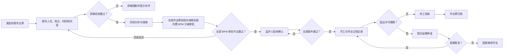

# 8. 特殊作业管控模块 PRD

## 8.1 模块概述

### 8.1.1 模块定位

特殊作业管控模块以作业票为核心，一期管理动火、高处、临时用电、有限空间四类作业的申请、人员资格校验、风险分析、安全措施审核、分级审批、现场监护确认、作业执行、完工验收和归档；其他作业类型保留扩展能力但不纳入一期验收。系统必须把“规则要求的资格不满足”和“安全条件未确认”作为真正的流程闸门，而不是展示字段。

### 8.1.2 模块组成

| 序号 | 子模块 | 核心职责 | 面向角色 |
|---|---|---|---|
| 1 | 作业票申请 | 作业基本信息、人员、时间、区域和方案录入 | 作业申请人 |
| 2 | 资格准入 | 校验作业人员、监护人、审批人证书有效性 | 系统自动 |
| 3 | 风险分析与措施 | 关联风险点/危险源，填写作业风险和措施 | 申请人 / 授权管理人员 |
| 4 | 分级审批 | 按作业类型×级别执行现场负责人、部门、公司或更高层级审批 | 授权岗位 |
| 5 | 监护与执行 | 现场逐项确认、开工、暂停、恢复和完工 | 监护人 / 作业负责人 |
| 6 | 验收归档 | 完工检查、附件归档、作业数据统计 | 授权验收人员 |

### 8.1.3 模块内部关系

```
作业申请 → 资格校验 → 作业风险分析/措施 → 按类型×级别分级审批
    │            │                                  │
    └─不通过阻断─┘                                  ▼
                                              监护人现场确认
                                                    │ 全部通过
                                                    ▼
                                              允许开工/执行
                                                    │
                                             暂停/恢复/异常
                                                    │
                                                    ▼
                                              完工验收 → 归档
```

### 8.1.4 与其他模块的依赖关系

| 依赖模块 | 依赖内容 | 依赖方式 |
|---|---|---|
| 风险管理 | 风险点、危险源、作业风险分析输出和控制措施 | 申请时引用并形成作业票快照，风险变化不直接覆盖在办作业票 |
| 培训与证书 | 当前有效特种作业证、安全资格证及培训记录来源标识 | 提交和开工前按规则实时校验；资格阻断可跳转证书管理换证，培训记录只读查询 |
| 组织权限 | 作业区域、申请人、审批链、监护人 | 自动确定数据范围和审批节点 |
| 隐患治理 | 作业现场发现的隐患和整改要求 | 作业中可转隐患，未闭环可阻断验收 |
| 系统内置 BPM / 企业微信 | 作业票分级审批、延期审批、超时和证书到期提醒 | 系统内置 BPM 微服务统一管理流程、节点、人员、意见和时间；各节点待办推送企业微信 |
| 移动现场 | 监护确认、现场拍照、开工和完工 | 现场执行入口 |

### 8.1.5 核心业务流转图



说明：一期作业类型固定为动火、高处、临时用电、有限空间；作业票和延期申请均调用系统内置 BPM 微服务。特殊作业模块不自建审批路径、审批待办或审批状态机，只读取 BPM 返回的审批节点、审批人、意见和时间，各审批待办推送企业微信；特殊作业不接入 OA，不以提醒替代超时延期审批。

### 8.1.6 审批岗位矩阵确认边界

系统提供“四类作业 × 一级/二级/三级/特级”的 BPM 审批岗位矩阵配置，矩阵节点只能从安全业务岗位字典中选择。集团监督检查是监督检查角色，不得作为特殊作业审批节点。当前原型中的路径仅用于演示 BPM 逐节点审批能力，不作为正式岗位定稿；正式矩阵须由业务单位按四类作业和四级分别签字确认后固化，并由 BPM 保存流程定义和路径快照。后续修改矩阵不得改写在办或已归档作业票。

申请人、作业负责人、监护人、作业人员及审批办理人均从 OA 在职人员中选择，保存 OA 稳定人员标识、姓名、组织和岗位快照；表单不得用自由文本姓名代替人员选择。监护人支持多人选择，与作业人员分别维护，同一人员不得同时作为本票作业人员和监护人。

## 8.2 数据模型

### 8.2.1 work_permit — 特殊作业票

| 字段 | 类型 | 必填 | 说明 |
|---|---|:---:|---|
| id | bigint PK | ✓ | 主键 |
| permit_code | varchar(64) UNIQUE | ✓ | 作业票编号：`WP-YYYYMMDD-NNN` |
| work_type | varchar(32) | ✓ | 一期：动火、高处、临时用电、有限空间；其他类型预留 |
| org_id | bigint FK | ✓ | 所属组织 |
| location | varchar(200) | ✓ | 作业地点 |
| work_content | text | ✓ | 作业内容和步骤 |
| applicant_user_id | bigint FK | ✓ | 申请人 |
| work_leader_id | bigint FK | ✓ | 作业负责人 |
| guardian_user_ids | json | ✓ | 一名或多名现场监护人；与作业人员分别选择 |
| planned_start / planned_end | datetime | ✓ | 计划作业窗口 |
| risk_level | varchar(16) | ✓ | 作业风险等级 |
| permit_level | varchar(16) | ✓ | 仅允许一级、二级、三级、特级四档，按作业类型×级别读取受控审批规则 |
| approval_mode | varchar(32) | ✓ | 由作业类型×级别规则解析：现场负责人、部门、公司或更高层级 |
| bpm_process_instance_id | varchar(128) | — | 系统内置 BPM 返回的作业票审批流程实例标识 |
| approval_snapshot_no | varchar(64) | — | 提交 BPM 时冻结的作业票业务快照编号 |
| approval_status / approval_current_node | varchar(32)/varchar(128) | — | 从 BPM 同步的审批状态和当前节点摘要，不作为模块审批状态机 |
| approval_completed_at | datetime | — | BPM 审批完成时间 |
| status | varchar(32) | ✓ | 作业票状态 |
| safety_plan | text | ✓ | 安全方案 |
| emergency_plan | text | — | 应急处置 |
| created_at / archived_at | datetime | ✓ | 创建和归档时间 |
| max_validity_minutes | int | — | 按作业类型×级别规则计算的最长许可时长 |
| extension_status | varchar(32) | ✓ | `NONE`、`REQUESTED`、`APPROVED`、`REJECTED`、`EXPIRED_BLOCKED` |
| extension_requested_by / extension_requested_at | bigint/datetime | — | 延期申请人和时间 |
| extension_approved_by / extension_approved_at | bigint/datetime | — | 延期批准人和时间 |
| extension_reason | varchar(1000) | — | 延期申请和批准意见；申请时必填 |
| extension_bpm_process_instance_id / extension_approval_node | varchar(128)/varchar(128) | — | 延期申请 BPM 流程实例标识及 BPM 当前节点摘要 |

### 8.2.2 work_permit_person — 作业人员

| 字段 | 类型 | 必填 | 说明 |
|---|---|:---:|---|
| permit_id | bigint FK | ✓ | 作业票 |
| user_id | bigint FK | ✓ | 人员 |
| person_role | varchar(32) | ✓ | 作业人员、负责人、监护人、审批人 |
| certificate_required | tinyint | ✓ | 是否按作业类型×级别规则要求证书 |
| qualification_status | varchar(32) | ✓ | 有效、即将到期、过期、不满足、规则豁免 |
| certificate_source | varchar(32) | — | 平台维护、受控导入；人员来自 OA，证书引用培训与证书模块当前有效版本 |
| checked_at | datetime | ✓ | 校验时间 |

### 8.2.3 work_permit_risk — 作业风险分析

| 字段 | 类型 | 必填 | 说明 |
|---|---|:---:|---|
| id | bigint PK | ✓ | 主键 |
| permit_id | bigint FK | ✓ | 作业票 |
| risk_id / hazard_source_id | bigint FK | — | 引用风险点/危险源 |
| hazard_text | varchar(1000) | ✓ | 作业过程危险因素 |
| control_measure | varchar(1000) | ✓ | 作业控制措施 |
| confirmed | tinyint | ✓ | 是否已确认 |

### 8.2.4 work_permit_check — 现场确认项

| 字段 | 类型 | 必填 | 说明 |
|---|---|:---:|---|
| id | bigint PK | ✓ | 主键 |
| permit_id | bigint FK | ✓ | 作业票 |
| check_type | varchar(32) | ✓ | 隔离、检测、防护、消防、天气、人员等 |
| check_text | varchar(500) | ✓ | 确认内容 |
| result | varchar(32) | ✓ | 通过、不通过、不适用 |
| evidence_ids | json | — | 照片/检测记录 |
| checked_by / checked_at | — | ✓ | 确认人和时间 |

### 8.2.5 work_permit_action — 作业票动作

| 字段 | 类型 | 必填 | 说明 |
|---|---|:---:|---|
| id | bigint PK | ✓ | 主键 |
| permit_id | bigint FK | ✓ | 作业票 |
| action_type | varchar(32) | ✓ | 提交、资格校验、审核、审批、监护确认、开工、暂停、恢复、完工、验收、归档、重新申请、延期申请、延期批准、延期驳回、超时阻断 |
| actor_user_id | bigint FK | ✓ | 操作人 |
| action_note | text | — | 意见 |
| action_at | datetime | ✓ | 时间 |

## 8.3 状态流转

```
  DRAFT → SUBMITTED → QUALIFICATION_CHECK → BPM_APPROVAL → GUARDIAN_CONFIRM
  │         │              │                     │                │
  └─编辑    └─资格失败阻断  └─规则不满足阻断         └─按类型/级别退回   └─条件不通过阻断
                                                                  │ 全部通过
                                                                  ▼
                                                              READY_TO_START
                                                                  │ 开工
                                                                  ▼
                                                               IN_PROGRESS
                                                         ┌─────────┴──────────────┐
                                                         ▼                        ▼
                                                      PAUSED                EXTENSION_REQUESTED
                                                         │                        │
                                                         │               批准前 EXPIRED_BLOCKED
                                                         │                        │
                                                         └──────────────→ COMPLETED
                                                                            │ 验收
                                                                            ▼
                                                                       ACCEPTED → ARCHIVED
```

许可时间到期或预计无法在有效期内完成时，作业负责人必须先提交延期申请并填写原因、延长时段，逐项复核作业人员及资格、监护人员、作业地点及范围、环境/气体/天气条件、隔离防护及应急措施五类安全条件。延期批准前状态为 `EXPIRED_BLOCKED`，开工、继续作业、恢复和完工按钮全部阻断；批准后清空原现场确认结果，重新执行监护/现场确认后方可恢复。一级动火初次许可不超过 8 小时，每次延期同样最多延长 8 小时。

## 8.4 功能清单

| 编号 | 功能点 | 操作 | 说明 | 权限 |
|---|---|---|---|---|
| F-WP-01 | 创建作业票 | 新增 | 选择作业类型，填写地点、内容、时间、人员和方案 | 作业申请人 |
| F-WP-02 | 资格校验 | 系统自动 | 按作业类型×级别规则校验作业人员、负责人和监护人证书；规则豁免时记录依据 | 系统自动 |
| F-WP-03 | 作业风险分析 | 编辑 | 引用风险管理危险源和措施，补充作业过程风险 | 申请人 / 授权管理人员 |
| F-WP-04 | 分级审批 | 操作 | 一期四类作业按一级/二级/三级/特级解析 BPM 审批岗位；冻结作业票快照后调用 BPM 逐节点办理，读取审批人、意见和时间，全部通过后进入监护确认 | 对应业务流程岗位 |
| F-WP-06 | 监护确认 | 移动端 | 一名或多名监护人逐项确认现场安全条件并拍照留证 | 监护人 |
| F-WP-07 | 开工/暂停/恢复 | 操作 | 全部确认通过后，完成业务签到、现场位置校验和开工照片才允许开工；执行中可记录过程照片，异常可暂停，恢复需重新确认变化项 | 作业负责人 / 监护人 |
| F-WP-08 | 完工验收 | 操作 | 核对人员撤离、工具清点、现场清理、隔离恢复和遗留风险 | 授权验收人员 |
| F-WP-09 | 作业票归档 | 系统/操作 | 完工验收通过后锁定单据和证据，形成可追溯档案 | 授权管理人员 |
| F-WP-10 | 超时与延期 | 申请/审批 | 到达许可期限前提醒；超时必须提交延期申请，批准前阻断继续作业，批准后才恢复，不得仅以提醒或自动失效替代延期审批 | 作业负责人 / 对应审批岗位 |
| F-WP-11 | 延期审批 | 操作 | 审核延期原因、延长时段和复核证据；批准前保持 `EXPIRED_BLOCKED` | 对应业务流程岗位 |

## 8.5 业务规则

| 编号 | 规则 |
|---|---|
| BR-WP-01 | 当作业类型×级别规则要求证书时，资格校验读取培训与证书模块的当前有效证书；失败时禁止提交或开工，必须展示人员、缺失证书、过期时间和证书管理入口。换证后须重新校验；规则豁免必须记录依据 |
| BR-WP-02 | 作业票计划时间必须在当前人员、区域和作业资源允许范围内；同一区域冲突需提示 |
| BR-WP-03 | 一期四类作业按规则配置一名或多名监护人；监护人与作业人员必须分开选择，有限空间必须配置检测记录和应急救援条件 |
| BR-WP-04 | 审批路径由作业类型×级别规则决定并由系统内置 BPM 微服务执行；当前节点仅对应业务岗位可在 BPM 待办中办理，驳回后按意见修改并重新生成业务快照后重提，全部节点通过后才能进入监护确认。特殊作业模块不得自行推进审批节点。 |
| BR-WP-05 | 现场确认项全部通过后，还必须完成与作业票绑定的签到、位置校验和开工照片才允许开工；定位异常时必须填写说明。新增人员、位置、时间或风险措施后需重新确认 |
| BR-WP-06 | 作业票关闭不代表现场隐患自动关闭；作业中发现的问题独立进入隐患治理 |
| BR-WP-07 | 作业票人员、地点、时间或关键措施变更时，结束当前申请并重新发起审批；归档后作业票、审批意见、资格校验、监护确认和照片只读 |
| BR-WP-08 | 一期不要求连续视频拍摄；开工照片必填，执行中支持随时追加过程照片，至少留存监护确认、开工、暂停/恢复（如发生）、完工和验收等关键动作及证据 |
| BR-WP-09 | 一期作业类型固定为动火、高处、临时用电、有限空间；每类仅允许一级、二级、三级、特级四档，级别和审批规则由受控矩阵解析 |
| BR-WP-10 | 作业票超过许可时限必须走延期申请；延期批准前阻断继续作业、恢复和完工，批准后才可恢复并留存审批意见 |
| BR-WP-10a | 一级动火初次许可时长不得超过 8 小时，每次延期新增时长也不得超过 8 小时；每次延期独立校验，不因多次延期放宽单次上限 |
| BR-WP-11 | 平台管理员只维护配置、字典和岗位映射，不得代办作业票审核、审批、延期批准、监护确认或验收 |

## 8.6 接口清单

| Method | 路径 | 说明 |
|---|---|---|
| POST/GET | `/api/v1/work-permits` | 创建/查询作业票 |
| GET | `/api/v1/work-permits/{id}` | 详情、风险分析、人员和检查项 |
| POST | `/api/v1/work-permits/{id}/qualification-check` | 按类型×级别规则执行资格校验 |
| GET | `/api/v1/certificates/qualification` | 查询人员当前有效证书；资格结果写入作业票快照 |
| POST | `/api/v1/work-permits/{id}/submit` | 冻结作业票快照并调用 BPM 分级审批流程发起接口 |
| GET | `/api/v1/work-permits/{id}/approval` | 按 BPM 流程实例查询审批节点、审批人、意见、时间和当前状态 |
| POST | `/api/v1/bpm/tasks/{taskId}/action` | BPM 统一任务办理接口；特殊作业模块不提供本模块审批动作接口 |
| POST | `/api/v1/work-permits/{id}/guardian-confirm` | 监护确认 |
| POST | `/api/v1/work-permits/{id}/start` | 开工 |
| POST | `/api/v1/work-permits/{id}/pause` | 暂停 |
| POST | `/api/v1/work-permits/{id}/resume` | 恢复 |
| POST | `/api/v1/work-permits/{id}/extension-request` | 提交延期申请并调用 BPM 延期审批流程发起接口；申请原因和延长时段必填 |
| POST | `/api/v1/work-permits/{id}/complete` | 完工申请 |
| POST | `/api/v1/work-permits/{id}/accept` | 完工验收 |
| POST | `/api/v1/work-permits/{id}/archive` | 归档 |

## 8.7 页面清单

| 页面名称 | 路由 | 说明 |
|---|---|---|
| 特殊作业管控 | `/work-permits` | 作业票台账、筛选、状态和待办 |
| 作业票申请 | `/work-permits/create` | 作业信息、人员、风险分析和措施 |
| 作业票详情 | `/work-permits/:id` | 状态步骤、审批意见、监护记录和附件 |
| 监护确认 | `/mobile/work-permits/:id/guardian` | 现场逐项确认和拍照 |
| 作业执行 | `/mobile/work-permits/:id/execute` | 开工、暂停、恢复和完工 |
| 移动作业票地图 | `/mobile/work-permits/map` | 仅查看当前未完成作业票 |

## 8.8 非功能与验收

- 资格校验、作业票状态更新和审批动作必须事务一致。
- 现场确认支持弱网重试，但同一确认项不得重复写入。
- 必须完成“申请→多监护人与作业人员分开选择→资格阻断→补齐资格→冻结快照→调用系统内置 BPM 分级审批→监护确认→签到/位置校验/开工照片→开工→过程照片→完工→验收→归档”的验收。
- 必须完成“一级动火每次延期不超过 8 小时→作业超时→延期申请→批准前阻断继续作业→延期批准→复核后恢复”的验收。
- 当前项目状态：原演示系统已有特殊作业票和资格闸门交互；生产后端、资质服务和审批联调尚待建设。
