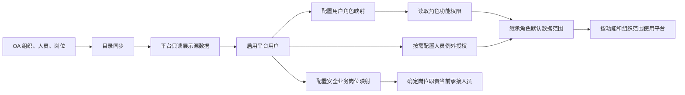

# 安全管理平台目标职责模块 PRD

> 状态：业务规则基线  
> 范围：一期 PC 端原型及后续生产实现依据  
> 前置条件：OA 向安全管理平台同步组织、部门、人员、岗位和在职状态数据；企业微信仅提供移动工作台入口和待办消息投递渠道。

## 1. 模块定位

“目标职责”不是年度目标考核模块。本期用于建立安全管理平台的组织权限基础能力，并维护岗位安全职责清单。

模块由两组功能组成：

```text
目标职责
├─ 机构和职责
│  ├─ 组织机构维护
│  ├─ 组织人员维护
│  ├─ 用户信息维护
│  ├─ 角色管理
│  └─ 角色数据权限
└─ 安全履职
   └─ 岗位安全职责清单
```

本期不建设年度目标、指标分解、履职填报、评分、签字确认、OA 审批或考核任务。

## 2. 数据边界

| 数据 | 唯一来源 | 安全管理平台处理方式 |
|---|---|---|
| 组织、部门 | OA | 同步、查询、只读；可补充安全平台属性 |
| 人员、岗位、在职状态 | OA | 同步、查询、只读；以 OA 稳定组织、人员和岗位标识作为引用键 |
| 平台访问用户 | 安全管理平台 | 关联 OA 在职人员后启用或停用 |
| 安全业务岗位映射 | 安全管理平台 | 将 OA 人员映射为指定组织下的安全业务岗位，用于确定岗位职责当前承接人员 |
| 安全业务角色 | 安全管理平台 | 配置人员可以使用的功能权限 |
| 角色默认数据范围 | 安全管理平台 | 按角色统一配置默认范围及解析依据，不绑定具体人员 |
| 人员例外授权 | 安全管理平台 | 对确需跨组织查看的 OA 人员配置额外组织范围、原因和有效期 |
| 岗位安全职责 | 安全管理平台 | 按组织和岗位维护、启停及版本追溯 |
| 历史业务人员信息 | 安全管理平台 | 保存业务发生时的人员、组织和岗位快照 |

组织机构维护和组织人员维护中的“维护”是同步、查询和补充平台属性，不允许在平台新增、删除、改名或调动 OA 组织人员。

OA 人员同步与 OA BPM 审批是两项独立集成：前者仅同步主数据，不创建审批；集团监督检查调用 OA BPM 时，不得反向改写 OA 人员主数据。企业微信不作为组织、人员、岗位或在职状态来源，只根据 OA 人员稳定标识与企业微信接收身份的有效映射投递平台待办消息。投递失败进入重试和告警，不影响业务单据或 BPM 审批状态。

## 3. 页面设计

### 3.1 组织机构维护

页面采用“左侧组织树＋右侧组织详情”。

OA 同步只读字段：

- 组织名称、编码和上级组织；
- 组织层级和负责人；
- 目录状态和最近同步时间。

平台可维护字段：

- 是否纳入安全平台；
- 平台组织类型；
- 是否为安全管理部门；
- 显示顺序。

主要操作：同步组织、查看同步记录、配置平台属性。页面不得出现新增组织、删除组织或修改 OA 源字段的操作。

### 3.2 组织人员维护

左侧选择组织，右侧显示本组织及下级组织人员。支持按姓名、岗位、OA 人员 ID 和在职状态查询。

列表字段：姓名、OA 人员 ID、所属组织、岗位、直属负责人、在职状态、同步时间。

主要操作：同步人员、查看同步记录、查看人员详情。人员姓名、组织、岗位和在职状态全部只读。

人员调岗或离职后，当前目录随 OA 同步更新；平台账号和安全业务角色需要重新校验，历史业务记录保留原快照。

### 3.3 用户信息维护

组织人员代表 OA 中的自然人，用户信息代表该人员是否可以访问安全管理平台，两者不得混为一项数据。

列表字段：姓名、OA 人员 ID、企业微信消息绑定状态、默认组织、安全业务岗位、安全业务角色、账号状态、最后登录时间。

主要操作：

- 从 OA 在职人员中启用平台用户；
- 启用或停用平台访问；
- 设置登录后的默认组织；
- 配置业务岗位：选择责任组织、安全业务岗位、生效日期和失效日期；
- 配置用户角色：从当前启用的安全业务角色中勾选，形成 OA 人员与安全业务角色的映射；
- 查看角色和数据权限摘要。

平台不设置脱离 OA 人员的本地账号。停用账号不删除历史业务记录，未完成业务应由授权人员另行转交。

业务岗位映射、用户角色映射、角色管理和角色数据权限必须分开：业务岗位映射回答“谁承担这个岗位”，用户角色映射回答“这个人员具有什么角色”，角色管理回答“角色可以操作什么”，角色数据权限回答“角色默认可以查看哪些范围以及人员有哪些例外授权”。同一人员可以承担多个组织或多个安全业务岗位，也可以获得多个角色，但每条映射必须独立启停和留痕。

### 3.4 角色管理

角色管理负责“可以使用哪些功能”，不直接决定能够查看哪些组织数据。

字段：角色名称、角色编码、角色类型、适用组织层级、功能权限、已关联用户数、状态。

主要操作：新增、编辑、复制、启用、停用、查看。

初始角色包括平台管理员、岗位映射管理员、集团监督检查、集团专业检查、二级单位领导、二级单位安全管理人员、作业区负责人、班组长、班组成员和管理查看人员。

平台管理员和岗位映射管理员只能配置系统，不因管理权限获得风险审批、隐患复查、作业验收等业务办理权。

### 3.5 角色数据权限

角色数据权限负责“可以查看和办理哪些范围的数据”，与角色功能权限分开配置，并拆成两类：

1. 角色默认数据范围：字段为安全业务角色、默认范围类型、范围解析依据、状态。每个角色只维护一条默认规则，例如“集团专业检查＝同专业部门，按 OA 所属专业部门解析”“班组长＝本班组，按业务岗位责任组织解析”。
2. 人员例外授权：字段为 OA 人员 ID、安全业务角色、额外授权组织、授权原因、生效日期、失效日期、状态。仅在确需跨组织查看时建立，不替代角色默认规则。

主要操作：配置/编辑/启停角色默认范围、查看规则说明、新增/编辑/启停人员例外授权。

用户通过角色映射自动继承角色默认范围；多角色时功能权限取启用角色的并集，数据范围取各角色默认范围与有效例外授权的并集。审批、整改、复查和验收仍需匹配业务流程岗位，不能只凭数据可见权限办理。例外授权必须有原因和有效期，人员主键使用 OA 稳定人员标识，不以姓名作为授权键。

### 3.6 岗位安全职责清单

职责以“责任组织＋安全业务岗位”为维护对象，不直接绑定具体人员。系统根据用户信息维护中的有效业务岗位映射查找当前承接人员，人员姓名、OA 身份和在职状态均以 OA 为准。

字段：职责编号、责任组织、责任岗位、当前承接人员、人员匹配状态、职责类别、岗位安全职责、制度或法规依据、版本、生效日期、状态、更新时间。

主要操作：新增、编辑并生成新版本、启用、停用、查看详情、查看人员绑定、查看历史版本。未匹配人员时显示“前往用户信息维护”。

人员调岗时不重建职责；岗位映射管理员停用原映射并配置新人员后，当前承接人员随有效映射更新。职责编辑保存后生成新版本，历史版本保存当时的人员快照用于追溯，在线查询默认读取当前有效映射和当前生效职责版本。

## 4. 核心业务流转

### 4.1 OA 目录到平台权限



### 4.2 岗位安全职责


## 5. 权限规则

| 角色 | 组织人员 | 平台用户 | 业务岗位映射 | 角色/数据权限 | 岗位职责 |
|---|---|---|---|---|---|
| 平台管理员 | 同步、查看 | 启停 | 维护 | 维护 | 查看，不得代办业务 |
| 岗位映射管理员 | 同步、查看 | 启停 | 维护 | 维护 | 查看 |
| 二级单位安全管理人员 | 查看 | 查看 | 查看 | 查看 | 维护本单位职责 |
| 其他业务角色 | 按权限查看 | 查看本人 | 查看本人 | 查看本人摘要 | 查看授权范围职责 |

## 6. 状态与异常规则

- 组织和人员目录状态以 OA 为准，平台不自行改写。
- 平台用户状态只保留启用、停用。
- 角色、角色默认范围、人员例外授权和岗位职责状态只保留启用、停用。
- OA 同步失败时保留上次成功数据，并展示失败批次和原因，不得清空平台目录。
- OA 人员离职后平台账号自动停止有效访问，角色映射结束；未完成业务只提示转交，不自动改变业务责任人。
- 岗位没有有效业务岗位映射时显示“未匹配”，并提供前往用户信息维护的入口；不允许在岗位职责表单中手工填写人员名称替代映射。
- OA 人员调岗或离职后，当前业务岗位映射应提示失效或由管理员停用；历史职责和历史业务单据继续保留原人员快照。

## 7. 原型验收标准

| 编号 | 验收场景 | 预期结果 |
|---|---|---|
| TC-01 | 查看组织机构 | 展示完整组织树，OA 源字段只读，平台属性可配置 |
| TC-02 | 查看自动线组和制模组人员 | 展示已确认的两班组人员、岗位和在职状态，不提供源数据编辑按钮 |
| TC-03 | 启用平台用户 | 只能选择 OA 在职人员，成功后显示账号状态和默认组织 |
| TC-04 | 配置业务岗位 | 只能选择已启用的 OA 在职人员，配置组织和安全业务岗位后，相关职责显示当前承接人员 |
| TC-05 | 新增或编辑角色 | 可配置功能权限；平台管理员不获得业务代办权限 |
| TC-06 | 配置角色数据权限 | 可按角色配置默认范围和解析依据，不出现人员列；可另行为 OA 人员新增带原因和有效期的例外授权 |
| TC-06a | 配置用户角色 | 可在用户信息维护中勾选启用角色；保存后用户详情及角色关联人数同步更新 |
| TC-07 | 新增岗位职责 | 按责任组织和安全业务岗位带出有效映射人员并保存 V1.0 |
| TC-08 | 查看人员绑定 | 展示映射人员、OA 原始岗位、有效期和状态；未匹配时可跳转用户信息维护 |
| TC-09 | 编辑岗位职责 | 生成下一版本，历史版本可查看并保留当时人员快照 |
| TC-10 | 关闭、取消、启停 | 弹窗关闭和取消生效；用户、业务岗位映射、用户角色、角色、默认范围、例外授权和职责状态变化可见 |

## 8. 当前实现边界

当前整体原型使用本地 Mock 数据演示 OA 目录、平台用户、业务岗位映射、安全业务角色、数据权限和岗位职责交互。尚未完成 OA 人员同步、企业微信身份映射和消息投递、生产权限校验、持久化、同步冲突处理和正式审计服务，不能描述为已经完成真实集成。
