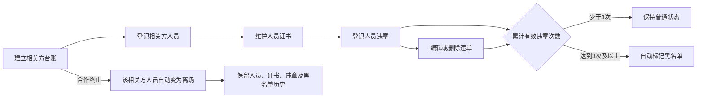

# 安全管理平台相关方管理模块PRD

版本：v1.1（原型确认稿，2026-09-01）

适用范围：太重集团安全管理平台一期——铸锻件分公司、智能加工配送中心

对应原型：`platform-v2/docs/prototype/overall/parties.html`

文档状态：已确认，可作为研发、测试和实施依据

## 1. 模块定位

相关方管理用于各分子公司维护进入本单位开展服务、施工或作业的外部单位及其人员信息，集中形成相关方台账、人员与证书台账、违章记录和黑名单标记。

模块采用简单台账式管理，不设置独立审批流程。各分子公司维护本单位数据，集团监督检查和集团专业检查角色可跨单位查看全部数据，但不直接修改各单位台账。

## 2. 产品目标

1. 统一记录相关方单位、人员、证书和违章信息，避免分散台账难以查询。
2. 按人员累计违章次数自动形成黑名单标记，便于安全管理人员重点关注。
3. 在相关方合作终止时联动更新人员在场状态，同时完整保留历史记录。
4. 通过单位数据权限隔离，确保各分子公司只能查看和维护本单位数据，集团可查看全部单位数据。

## 3. 一期范围与边界

### 3.1 一期建设范围

1. 相关方台账。
2. 人员与证书。
3. 违章记录。
4. 黑名单。
5. 合作状态与人员状态联动。
6. 分子公司数据隔离及集团跨单位查看。

### 3.2 一期不包含

1. 相关方公司资质管理。
2. 相关方准入、合同、评价和退场审批流程。
3. OA或安全管理平台BPM审批。
4. 黑名单自动拦截门禁、作业票、系统登录或人员入场。
5. 相关方人员同步至OA组织人员；相关方人员由本模块独立维护。

## 4. 用户与数据权限

| 用户类型 | 数据范围 | 主要权限 |
|---|---|---|
| 有维护权限的分子公司人员 | 本分子公司 | 查询、新增、编辑本单位相关方、人员、证书和违章记录；删除本单位违章记录 |
| 二级单位领导及其他本单位查看人员 | 本分子公司 | 查看本单位相关方及其人员、证书、违章和黑名单信息 |
| 集团监督检查 | 全集团 | 跨单位查询和查看全部相关方及黑名单数据，不直接修改 |
| 集团专业检查 | 全集团 | 跨单位查询和查看全部相关方及黑名单数据，不直接修改 |
| 平台管理员 | 按单独授权范围 | 负责系统配置和运维，不因管理员身份自动获得业务维护权限 |

权限规则：

1. 各分子公司之间数据相互隔离，不得查看或修改其他分子公司的相关方数据。
2. 集团监督检查、集团专业检查可查看全部分子公司数据，页面提供维护单位筛选条件。
3. 新增数据时，维护单位默认取当前用户所属分子公司，不允许选择无权维护的单位。
4. 编辑、删除操作必须同时校验角色权限和数据所属单位。

## 5. 总体业务流程

## 6. 页面结构

相关方管理作为独立一级模块，左侧菜单下设置四个独立页面：

| 页面 | 原型入口 | 页面用途 |
|---|---|---|
| 相关方台账 | `parties.html#ledger` | 维护相关方公司基本信息和合作状态 |
| 人员与证书 | `parties.html#people` | 维护相关方人员及其证书 |
| 违章记录 | `parties.html#violations` | 登记、修改和删除人员违章记录 |
| 黑名单 | `parties.html#blacklist` | 查看系统自动形成的黑名单标记 |

页面统一采用“查询条件＋台账表格＋新增/编辑弹窗”的简洁结构。除违章删除确认弹窗外，普通新增、编辑弹窗点击遮罩区域不得自动关闭，用户必须点击“保存”或“取消/关闭”。

## 7. 功能需求

### 7.1 相关方台账

#### 7.1.1 查询与展示

支持按相关方名称、维护单位、服务内容和合作状态查询。列表展示：

- 相关方编号。
- 相关方公司名称。
- 维护分子公司。
- 服务内容。
- 联系人。
- 联系电话。
- 合作状态。
- 人员数量。
- 操作。

#### 7.1.2 新增与编辑

新增或编辑时填写：

| 字段 | 是否必填 | 说明 |
|---|---|---|
| 相关方编号 | 系统生成 | 保存后生成，不允许重复 |
| 相关方公司名称 | 是 | 同一维护单位下不得重复 |
| 维护分子公司 | 是 | 默认当前用户所属单位，只能选择有权维护的单位 |
| 服务内容 | 是 | 简要描述服务、施工或作业内容 |
| 联系人 | 是 | 相关方对接人 |
| 联系电话 | 是 | 联系人电话 |
| 合作状态 | 是 | 合作中、已结束 |

保存成功后刷新列表并提示操作成功；校验不通过时保留已填写内容并提示具体字段。

#### 7.1.3 合作状态联动

1. 将合作状态由“合作中”改为“已结束”时，系统二次确认。
2. 确认后，该相关方名下全部人员自动变为“离场”。
3. 人员、证书、违章和黑名单历史数据继续保留并可查询。
4. 合作已结束后，不允许新增人员、证书或违章记录；已存在记录允许有权限人员纠错编辑。
5. 将状态恢复为“合作中”时，人员不得自动恢复为“在场”，须由维护人员逐人确认后修改。

### 7.2 人员与证书

#### 7.2.1 查询与展示

支持按人员姓名、相关方公司、维护单位、工种、证书状态、在场状态和黑名单标记查询。列表展示：

- 人员姓名。
- 所属相关方公司。
- 工种或岗位。
- 联系电话。
- 证书数量。
- 证书状态。
- 在场状态。
- 黑名单标记。
- 操作。

#### 7.2.2 人员维护

人员表单包括：人员姓名、所属相关方公司、工种或岗位、联系电话、在场状态和备注。所属相关方必须从本单位“合作中”的相关方台账中选择。

人员状态只使用“在场”和“离场”；黑名单作为独立标记展示，不属于人员状态。

#### 7.2.3 证书维护

一个人员可维护多张证书，每张证书单独保存。证书表单包括：

- 证书名称。
- 证书编号。
- 有效期起止日期。
- 证书图片或PDF附件。
- 备注。

系统根据有效期展示“有效、临期、已过期”等证书状态。证书原始附件支持在线查看。

### 7.3 违章记录

#### 7.3.1 查询与展示

支持按相关方公司、人员姓名、维护单位、违章日期和黑名单标记查询。每条违章单独形成一条台账记录，列表展示：

- 违章编号。
- 相关方公司。
- 违章人员。
- 违章日期。
- 违章地点。
- 违章内容。
- 处理结果。
- 证据附件。
- 操作。

#### 7.3.2 新增与编辑

违章表单包括：相关方公司、违章人员、违章日期、违章地点、违章内容、处理结果、证据图片或PDF附件、备注。

选择相关方公司后，只能选择该公司名下人员。新增违章保存后，系统重新计算该人员累计有效违章次数。

#### 7.3.3 删除

1. 仅有维护权限的本单位人员可删除本单位违章记录。
2. 删除前弹出二次确认，明确显示违章人员、违章日期和违章内容摘要。
3. 用户确认后删除该条记录，并重新计算该人员累计有效违章次数和黑名单标记。
4. 用户取消时不改变任何数据。

### 7.4 黑名单

黑名单页面只用于查询系统自动标记结果，不提供手工新增和手工删除功能。列表展示：

- 人员姓名。
- 所属相关方公司。
- 维护分子公司。
- 工种或岗位。
- 累计有效违章次数。
- 首次达到三次日期。
- 当前在场状态。
- 标记状态。

黑名单判定规则：

1. 按人员累计有效违章次数计算，不按相关方公司合并计算。
2. 同一人员累计有效违章达到3次及以上时，自动标记为黑名单。
3. 违章记录被编辑或删除后，系统立即重新计算；累计次数低于3次时自动取消黑名单标记。
4. 黑名单只作为管理标记和查询提示，不自动限制门禁、特殊作业、系统登录或人员入场。
5. 相关方合作结束或人员离场后，既有黑名单历史仍予保留。

## 8. 状态与规则汇总

| 对象 | 状态或标记 | 变更规则 |
|---|---|---|
| 相关方 | 合作中、已结束 | 已结束时联动该公司全部人员变为离场 |
| 人员 | 在场、离场 | 合作终止自动离场；恢复合作后不自动恢复在场 |
| 证书 | 有效、临期、已过期 | 根据证书有效期自动计算 |
| 黑名单 | 未标记、已标记 | 按人员累计有效违章次数自动计算，达到3次标记，低于3次取消 |

## 9. 编号规则

1. 相关方编号由系统生成，格式示例：`RP-2026-0001`。
2. 人员编号由系统生成，格式示例：`RPP-2026-0001`。
3. 违章编号由系统生成，格式示例：`RPV-2026-0001`。
4. 编号生成后不得重复；业务数据被编辑时编号保持不变。

## 10. 异常与提示

1. 无权限访问其他分子公司数据时，页面不返回对应数据；通过异常入口访问时提示无权查看。
2. 合作已结束的相关方点击新增人员、证书或违章时，提示“该相关方合作已结束，不能新增记录”。
3. 删除违章导致人员不再满足黑名单条件时，提示“违章记录已删除，黑名单标记已重新计算”。
4. 附件格式或大小不符合要求时，明确提示支持的图片/PDF格式及大小限制。
5. 保存失败时保留表单内容，不清空用户已填写数据。

## 11. 验收标准

| 编号 | 验收场景 | 预期结果 |
|---|---|---|
| AC-RP-01 | 分子公司用户进入四个页面 | 只能看到本分子公司数据，只能维护本分子公司记录 |
| AC-RP-02 | 集团监督检查或集团专业检查进入四个页面 | 可查看全部分子公司数据，可按单位筛选，不显示业务编辑和删除入口 |
| AC-RP-03 | 新增或编辑相关方 | 校验必填项并成功刷新台账，相关方编号唯一 |
| AC-RP-04 | 将相关方改为已结束 | 二次确认后，名下人员全部变为离场，历史数据保留，不能再新增人员、证书和违章 |
| AC-RP-05 | 将相关方恢复为合作中 | 人员仍保持离场，不自动恢复在场，可由维护人员逐人修改 |
| AC-RP-06 | 为一个人员维护多张证书 | 每张证书可单独新增、编辑、查看附件并显示有效期状态 |
| AC-RP-07 | 新增第三条有效违章 | 保存后该人员自动出现在黑名单页面，累计次数为3 |
| AC-RP-08 | 编辑或删除违章使累计次数低于3次 | 二次确认后记录更新或删除，黑名单标记自动取消 |
| AC-RP-09 | 点击删除违章后取消 | 违章记录、累计次数和黑名单标记均不变化 |
| AC-RP-10 | 黑名单人员继续使用其他业务功能 | 仅显示黑名单提示，不自动拦截门禁、作业票、登录或入场 |
| AC-RP-11 | 四个页面查询同一相关方人员 | 公司、人员、证书、违章次数和黑名单标记保持一致 |

## 12. 交付与测试重点

1. 四个独立页面均可完成查询、分页、查看和权限控制演示。
2. 相关方台账、人员与证书、违章记录的新增和编辑操作可完整演示。
3. 违章记录删除、累计次数重算和黑名单自动取消必须联动验证。
4. 合作终止后人员自动离场、禁止新增和历史保留必须联动验证。
5. 至少使用两个分子公司账号和两个集团角色账号验证单位隔离与集团只读查看。

## 13. 确认结论

本版本已按确认原型固化相关方管理一期范围。模块以台账维护为主，不增加审批、准入拦截和公司资质等扩展功能；后续如需与门禁、特殊作业或承包商准入联动，应另行评审并形成新增需求。
