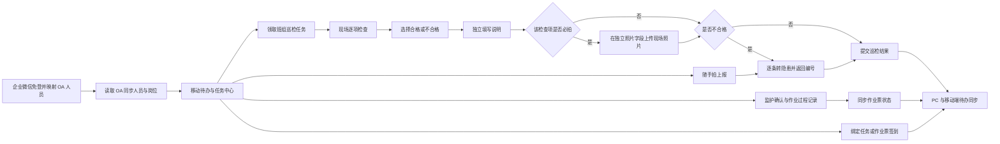

# 10. 移动现场端 PRD

## 10.1 模块概述

### 10.1.1 模块定位

移动现场端是安全管理平台面向岗位人员、巡检人员、作业负责人和监护人的现场操作入口，一期采用响应式 H5/企业微信工作台形态。OA 是组织、部门、人员、岗位和在职状态的唯一来源；企业微信只提供移动工作台入口和待办消息投递渠道。移动端复用平台基于 OA 人员标识配置的业务角色映射、组织权限和业务数据，不另建一套移动端业务台账。

一期重点覆盖任务待办、巡检执行、隐患随手拍、特殊作业监护与过程操作、业务签到、消息提醒和未完成作业票地图。移动端不承担风险辨识、LEC 评价、巡检计划编制、隐患督办配置和作业审批规则维护等复杂管理操作。移动待办与 PC 工作台共用同一待办对象和状态，不能形成两套责任或办理结果。

### 10.1.2 一期范围

| 序号 | 能力 | 一期职责 | 主要角色 |
|---:|---|---|---|
| 1 | 移动首页 | 展示今日任务、待办数量、现场预警，并将未读待办消息置于快捷入口之前 | 全体现场用户 |
| 2 | 任务中心 | 与 PC 工作台同步聚合待巡检、待整改、待复查、待监护、待执行等本人待办 | 全体现场用户 |
| 3 | 移动巡检 | 逐项检查、拍照、定位、异常转隐患和提交 | 巡检人员 / 岗位人员 |
| 4 | 隐患随手拍 | 现场拍照、位置、描述、建议等级和责任区域上报 | 全体授权人员 |
| 5 | 作业监护 | 安全条件逐项确认、现场证据和监护意见 | 监护人 |
| 6 | 作业过程 | 开工、暂停、恢复、完工和异常上报 | 作业负责人 / 监护人 |
| 7 | 现场签到 | 在巡检任务或作业票上下文中完成实名、时间和位置签到 | 被指派人员 |
| 8 | 消息中心 | 接收任务、退回、逾期、审批结果和作业预警，跳转业务详情 | 全体现场用户 |
| 9 | 现场作业地图 | 查看当前未完成作业票的位置、类型、状态和负责人 | 授权现场用户 |

### 10.1.3 一期不包含

- 不开发独立原生 iOS/Android APP；一期以企业微信工作台内的 H5 作为正式入口，普通手机浏览器仅用于受控调试，不作为业务验收入口。
- 不建设通用考勤、排班打卡、工资核算和人员轨迹系统。
- 不建设即时聊天、群聊和朋友圈式信息流。
- 不在移动端开展风险点建档、危险源辨识、LEC 评价、风险版本审批和四色图维护。
- 不要求连续录音录像或连续采集人员位置，只记录业务动作发生时的必要证据。
- 移动作业地图不展示全部风险点，只展示当前未完成作业票。

## 10.2 信息架构与导航

### 10.2.1 底部导航

```text
首页       任务       现场       消息       我的
 │          │          │          │          │
今日概览   分类待办   巡检/随手拍  通知列表   账号/组织
快捷入口   状态筛选   作业/签到    已读未读   设置/退出
```

“现场”采用功能面板，不再为巡检、隐患、作业、签到和地图增加多层菜单。用户从任务、消息或地图进入具体业务详情后完成操作。

### 10.2.2 页面清单

| 页面 | 路由 | 核心内容 |
|---|---|---|
| 移动首页 | `/mobile` | 今日任务、待办数量、作业预警、未读待办消息、快捷入口 |
| 任务中心 | `/mobile/tasks` | 本人任务、分类筛选、状态和截止时间 |
| 巡检执行 | `/mobile/inspection/tasks/:id` | 检查项、结果、拍照、定位、异常转隐患 |
| 隐患随手拍 | `/mobile/hazards/create` | 照片、位置、描述、建议等级、责任区域 |
| 隐患详情/办理 | `/mobile/hazards/:id` | 受理结果、整改反馈、复查信息和时间线 |
| 现场作业地图 | `/mobile/work-permits/map` | 当前未完成作业票地图与列表 |
| 作业票详情 | `/mobile/work-permits/:id` | 作业信息、风险措施、人员、状态和时间线 |
| 监护确认 | `/mobile/work-permits/:id/guardian` | 现场安全条件、证据和确认提交 |
| 作业执行 | `/mobile/work-permits/:id/execute` | 开工、暂停、恢复、完工和异常上报 |
| 签到记录 | `/mobile/check-ins` | 本人业务签到记录和异常说明 |
| 消息中心 | `/mobile/messages` | 未读/已读、业务分类、消息详情和跳转 |
| 我的 | `/mobile/profile` | 姓名、岗位、组织、版本信息和退出登录 |

## 10.3 跨模块业务关系

```text
企业微信入口身份 → OA 人员身份与岗位权限
        │
        ▼
移动首页 / 任务中心 / 消息中心
   ├──────────┬────────────┬──────────────┐
   ▼          ▼            ▼              ▼
巡检任务    隐患随手拍    特殊作业现场     业务签到
   │          │            │              │
   └─异常─────┴──────→ 隐患治理            │
                         ▲                 │
                         └────作业异常──────┘

未完成作业票 ──→ 现场作业地图 ──→ 作业票详情/监护/执行
```

移动端只调用各业务模块正式接口：巡检提交后写入巡检结果，随手拍创建隐患，作业操作改变作业票状态，签到绑定原业务单据，消息跳转到对应业务对象。PC 工作台和移动任务中心读取同一 `workbench_todo` 待办记录；任一端领取、转交、提交、退回或完成后，另一端刷新必须同步显示最新责任人、状态、截止时间和下一步动作。移动端本地缓存不得成为正式业务数据来源。

### 10.3.1 移动现场闭环图



说明：移动端风险地图只显示当前未完成作业票；签到不作为考勤功能。

## 10.4 核心交互流程

### 10.4.1 登录与首页

```text
打开移动端 → 企业微信免登 → 按企业微信接收身份映射 OA 稳定人员标识 → 读取 OA 同步的组织、人员和岗位 → 解析平台业务角色映射
          → 加载本人待办、未读消息和快捷入口 → 进入首页
```

1. 未登录或令牌失效时进入统一登录，不允许匿名查看业务数据。
2. 用户存在多个岗位时，默认使用主岗位，可在“我的”中切换授权岗位；切换后重新加载数据权限。
3. 首页数量必须来自真实待办，不使用静态演示数字；数量与 PC 工作台同一查询口径。
4. 点击数量卡片进入已带入类型和状态筛选条件的任务列表；PC 工作台或移动端任一端办理后，另一端刷新立即反映最新状态。
5. 待办对象必须携带业务类型、业务编号、责任人/岗位、截止时间、当前状态和下一步动作；消息只负责提醒，不替代待办状态。
6. 首页内容顺序固定为“今日概览/预警 → 未读待办消息 → 快捷入口”；已读消息不继续占用首页空间，在消息中心保留查询。

### 10.4.2 移动巡检

```text
任务中心 → 打开巡检任务 → 业务签到（按计划配置）
        → 逐项选择合格/不合格 → 分别填写说明、上传照片
        → 不合格项以说明为标题逐条转隐患 → 提交全部结果 → 任务完成
```

- 页面顶部固定展示任务编号、区域、计划时间、执行状态和进度。
- 检查结果只允许“合格”“不合格”；存在未选择结果的检查项时禁止提交。
- 每条检查项均分别展示“说明”和“照片”两个字段，不能合并保存；不合格时说明必填，照片是否必拍按检查标准逐条配置。
- 转隐患前按不合格检查项逐条展示预览；每个不合格检查项生成一条隐患，隐患标题等于该项巡检说明，重复点击不得重复创建。
- 提交失败时保留已填写内容，并显示“待重试”，成功同步后更新任务状态。

### 10.4.3 隐患随手拍

```text
现场入口 → 随手拍 → 拍照/选择现场照片 → 获取位置和区域
        → 填写问题描述、建议等级和建议责任区域 → 提交
        → 生成隐患编号 → 进入受理流程 → 返回上报结果
```

- 至少上传一张现场问题照片；照片应保留拍摄时间，位置采集失败时允许填写原因并手动选择区域。
- 建议等级不等于正式隐患等级，最终等级由授权受理人员确认。
- 提交成功必须显示隐患编号、受理状态和查看入口。
- 不得用历史导入数据冒充移动端自主上报；来源固定记录为 `MOBILE_REPORT`。

### 10.4.3a 隐患办理与复核待办

移动端与 PC 共用隐患主流程及办理人：受理人可直接定级分配或上报；上级直接分配，或提出意见交回原受理人。实际整改人提交说明和整改后照片后，复核待办只交最终定级分配人，不固定交作业区负责人。上级只提出意见而未分配的，不获得该单复核任务。复核驳回交原整改人重新反馈，历次照片及意见保留；不增加整改人申请协调入口。入口复用平台业务页面和工作台，不另建移动审批流；审批由系统内置 BPM 统一管理，OA 特例不变。

### 10.4.4 作业监护与过程

```text
任务/消息/地图 → 作业票详情 → 核对负责人、作业人员、多名监护人、时间、地点和风险措施
              → 业务签到 → 逐项监护确认 → 位置校验 → 上传开工照片
              → 开工 → 正常执行并补充过程照片 / 暂停 → 重新确认变化项 → 恢复
              → 完工申请 → 等待验收
```

- 作业人员与监护人必须分开选择，监护人支持多人；只有当前作业票指定的监护人和作业负责人才能看到对应操作按钮。
- 资格校验、审批或现场确认未通过时，开工按钮必须禁用并展示阻断原因。
- 开工前必须完成业务签到、现场位置校验并上传开工照片；定位失败或超出范围时必须填写异常说明并按规则阻断或留痕处理。
- 作业过程中可以分次上传过程照片，照片必须关联作业票、上传人和上传时间，不要求连续拍摄。
- 暂停必须填写原因；恢复前重新确认发生变化的安全条件。
- 人员、地点、时间或关键措施发生变化时，不允许在移动端直接覆盖原票，必须结束当前申请并重新发起。
- 作业票超过许可时限时，移动端显示 `EXPIRED_BLOCKED`，必须提交延期申请；延期批准前继续作业、恢复和完工按钮全部阻断，批准后才可按要求复核并恢复。
- 一级动火每次延期最多延长 8 小时；超过 8 小时必须阻断提交并提示重新填写延期时间。
- 一期记录关键业务动作和证据，不要求连续过程拍摄。

### 10.4.5 业务签到

签到不是独立考勤，必须由巡检任务或特殊作业票触发并绑定业务对象。

```text
业务详情 → 点击签到 → 获取实名用户、当前时间和位置
        → 展示签到结果 → 用户确认 → 写入签到记录
```

- 同一用户、同一业务对象、同一签到类型不得重复生成有效记录。
- 定位超出配置范围时提示异常，可按业务规则阻断或允许填写原因后提交。
- 定位不可用时不得伪造坐标，应记录失败原因、设备信息和人工说明。
- 签到记录不可由普通用户删除；授权人员作废时必须填写原因并保留原记录。

### 10.4.6 消息与待办

```text
业务状态变化 → 生成平台待办 → 推送企业微信 → 用户收到提醒
            → 点击消息 → 校验权限 → 跳转业务详情 → 完成操作
```

- 一期消息类型包括：新任务、临期、逾期、驳回起草人、整改/复查、系统内置 BPM 审批待办、OA最终结果、监护待办、作业超时和证书到期。
- 安全管理平台产生的所有待办必须推送企业微信并携带安全管理平台业务链接；系统内置 BPM 审批待办由 BPM 微服务生成，集团监督检查委托 OA BPM 后的 OA 内部普通审批节点由 OA 自身通知，平台不重复推送。
- 消息和待办分开：消息是通知记录，待办代表当前需要处理的业务任务；已读消息不会自动完成待办。
- 用户无权访问、业务已处理或链接失效时，展示明确原因和最新状态。
- 消息发送失败不回滚已完成业务动作，进入重试队列并记录最终发送结果。

### 10.4.7 现场作业地图

现场作业地图可沿用“风险地图”入口名称，但一期内容只展示当前未完成作业票：待审批、审批中、待监护确认、待开工、作业中、暂停中、超时阻断、延期审批中。

- 不展示草稿、退回、拒绝、已完工和已归档作业票。
- 支持地图/列表切换，并按作业类型、状态、区域和时间筛选。
- 地图标记展示作业类型、状态、地点、计划时段、负责人和监护人。
- 点击标记进入作业票只读详情；具备监护或执行权限时才展示办理按钮。
- 未提供精确坐标的作业票显示在“未定位作业”列表，不得随意落点。
- 地图使用现场二维厂区图和区域编码，不依赖互联网在线地图。

## 10.5 数据模型

移动端复用巡检、隐患、作业票、附件、组织用户和操作日志等现有业务表，仅增加跨模块现场协同对象。

### 10.5.1 field_check_in — 业务签到

| 字段 | 类型 | 必填 | 说明 |
|---|---|:---:|---|
| id | bigint PK | ✓ | 主键 |
| business_type | varchar(32) | ✓ | `INSPECTION_TASK` / `WORK_PERMIT` |
| business_id | bigint | ✓ | 关联业务对象 ID |
| check_in_type | varchar(32) | ✓ | 到场、监护、开工前或计划配置的签到类型 |
| user_id | bigint FK | ✓ | 签到人 |
| org_id | bigint FK | ✓ | 签到时所属组织 |
| longitude / latitude | decimal | — | 现场坐标；获取失败时为空 |
| location_text | varchar(300) | — | 区域或位置说明 |
| distance_meters | decimal | — | 与配置位置的距离 |
| result | varchar(32) | ✓ | `VALID` / `OUT_OF_RANGE` / `LOCATION_UNAVAILABLE` / `VOIDED` |
| exception_reason | varchar(500) | — | 异常说明或作废原因 |
| device_id_hash | varchar(128) | — | 设备匿名标识，不保存设备隐私明文 |
| checked_at | datetime | ✓ | 签到时间 |
| voided_by / voided_at | bigint/datetime | — | 作废人和时间 |

### 10.5.2 message_notification — 消息通知

| 字段 | 类型 | 必填 | 说明 |
|---|---|:---:|---|
| id | bigint PK | ✓ | 主键 |
| recipient_user_id | bigint FK | ✓ | 接收人 |
| message_type | varchar(32) | ✓ | 任务、临期、逾期、退回、审批结果、作业预警等 |
| title / content | varchar/text | ✓ | 标题和摘要 |
| business_type / business_id | varchar/bigint | ✓ | 跳转的业务对象 |
| priority | varchar(16) | ✓ | 普通、重要、紧急 |
| channel | varchar(32) | ✓ | 一期平台待办主渠道固定为企业微信；站内消息作为历史与补充查看 |
| delivery_status | varchar(32) | ✓ | 待发送、已发送、失败、重试中 |
| read_at | datetime | — | 站内消息阅读时间 |
| created_at | datetime | ✓ | 创建时间 |

### 10.5.3 移动端本地草稿

弱网草稿保存在终端本地安全存储中，至少包含业务类型、业务 ID、表单内容、附件上传状态、幂等键和最后修改时间。本地草稿不作为服务器正式记录；同步成功后应清理对应草稿，但保留服务器操作日志。

### 10.5.4 workbench_todo — 统一工作台待办

| 字段 | 类型 | 必填 | 说明 |
|---|---|:---:|---|
| id | bigint PK | ✓ | 待办主键，PC 工作台与移动端共用 |
| business_type / business_id | varchar/bigint | ✓ | 来源业务对象和编号 |
| assignee_user_id / assignee_post_id | bigint | ✓ | 当前责任人和业务流程岗位 |
| status | varchar(32) | ✓ | 与业务主单状态一致，不另设移动端状态 |
| due_at | datetime | — | 截止时间 |
| next_action | varchar(64) | ✓ | 当前用户可执行的下一步动作 |
| read_at | datetime | — | 消息阅读时间，不代表待办完成 |
| version | bigint | ✓ | 乐观锁版本，防止双端并发覆盖 |

同一业务动作只能生成一条有效待办；PC 和移动端都通过统一接口更新，状态变化和审计记录一致。

## 10.6 状态与操作反馈

### 10.6.1 本地提交状态

```text
编辑中 → 待上传 → 上传中 → 已同步
                    │
                    └──失败 → 待重试 → 上传中
```

### 10.6.2 统一反馈规则

| 场景 | 前端反馈 | 数据处理 |
|---|---|---|
| 提交成功 | 显示编号、最新状态和查看详情入口 | 刷新业务状态并清理本地草稿 |
| 网络中断 | 提示已保存本地，进入待重试 | 不重复创建正式业务记录 |
| 附件失败 | 标记具体失败附件，允许单独重传 | 保留已上传附件 ID |
| 权限变化 | 隐藏或禁用按钮并显示原因 | 重新获取本人权限和业务状态 |
| 状态已变化 | 提示其他人已处理，加载最新状态 | 不覆盖服务器最新数据 |
| 重复点击 | 按幂等键返回第一次成功结果 | 不重复生成巡检结果、隐患或签到 |

## 10.7 功能清单

| 编号 | 功能点 | 操作 | 说明 | 权限 |
|---|---|---|---|---|
| F-MOB-01 | 企业微信免登 | 登录/免登 | 从企业微信获取入口身份，映射 OA 稳定人员标识并读取 OA 同步的人员、组织、岗位和在职状态，再解析平台业务角色及数据范围 | 全体用户 |
| F-MOB-02 | 首页待办 | 查看/跳转 | 聚合本人真实任务和预警，未读待办消息前置展示，快捷入口后置 | 全体用户 |
| F-MOB-03 | 任务中心 | 筛选/办理 | 按业务类型、状态、截止时间查看本人待办 | 全体用户 |
| F-MOB-04 | 巡检执行 | 填写/提交 | 逐项选择合格/不合格，分别填写说明和照片；不合格项以说明为标题逐条转隐患 | 巡检人员 |
| F-MOB-05 | 隐患随手拍 | 新增 | 现场照片、位置、描述和建议责任区域 | 授权人员 |
| F-MOB-06 | 隐患整改/复查 | 反馈/办理 | 按角色填写整改证据或复查意见 | 责任人 / 复查人 |
| F-MOB-07 | 作业监护 | 确认 | 多名监护人按权限逐项确认现场条件并上传证据 | 指定监护人 |
| F-MOB-08 | 作业过程 | 操作 | 签到、位置校验、开工照片、开工、过程照片、暂停、恢复、完工和异常上报 | 作业负责人 / 监护人 |
| F-MOB-09 | 业务签到 | 签到 | 记录实名、时间、位置和关联业务对象 | 被指派人员 |
| F-MOB-10 | 消息中心 | 阅读/跳转 | 查看通知、标记已读并进入业务详情 | 消息接收人 |
| F-MOB-11 | 现场作业地图 | 查看/筛选 | 只展示当前未完成作业票 | 授权现场用户 |
| F-MOB-12 | 弱网重试 | 自动/手动 | 保存草稿、附件续传和幂等提交 | 系统自动 |

## 10.8 业务规则

| 编号 | 规则 |
|---|---|
| BR-MOB-01 | 移动端权限与 PC 端使用同一组织、岗位和数据权限模型，不因使用移动端扩大权限 |
| BR-MOB-02 | 任务中心与 PC 工作台只展示当前用户可办理或可查看的同一批待办，不展示无权限业务数量；两端状态、责任人、截止时间和下一步动作必须一致 |
| BR-MOB-03 | 巡检异常转隐患、随手拍上报、作业动作和签到均必须使用幂等键，重复提交不得生成重复记录 |
| BR-MOB-04 | 照片、位置和设备信息只用于业务证据；不连续跟踪人员位置，不采集与安全业务无关的信息 |
| BR-MOB-05 | GPS 默认作为现场证据，是否阻断由业务配置决定；定位失败或超范围必须留痕，不能伪造坐标 |
| BR-MOB-06 | 业务签到只用于巡检任务和特殊作业等具体单据，一期不作为考勤系统 |
| BR-MOB-07 | 消息已读不等于待办已完成；待办完成以对应业务状态为准 |
| BR-MOB-08 | 现场作业地图只显示待审批、审批中、待监护确认、待开工、作业中、暂停中、超时阻断、延期审批中的作业票 |
| BR-MOB-09 | 作业票资格、审批、监护或安全条件未满足时，移动端不得通过隐藏接口或前端修改绕过开工闸门 |
| BR-MOB-10 | 弱网草稿只在当前登录用户和当前设备可见，退出登录时提示存在未同步数据，不得静默丢弃 |
| BR-MOB-11 | 移动巡检每个不合格检查项分别转为一条隐患；重复点击按幂等键返回原隐患，不合并为单条隐患 |
| BR-MOB-11a | 移动巡检结果只允许合格、不合格；说明和照片为独立字段，不合格说明必填且直接作为隐患标题；照片按检查标准的逐条必拍配置校验 |
| BR-MOB-12 | 平台管理员和岗位映射管理员不得在移动端代办业务审批、复核、验收或关闭；按钮集合由业务流程岗位和当前状态共同决定 |
| BR-MOB-13 | OA 是组织、部门、人员、岗位和在职状态唯一来源；企业微信只提供移动入口与待办消息渠道。平台只配置基于 OA 稳定人员标识的业务角色映射，移动端不得维护人员基础数据 |
| BR-MOB-14 | 仅集团监督检查展示 OA BPM 状态跳转链接；该业务跨系统委托 OA BPM，不创建系统内置 BPM 审批任务。风险新增/变更/复评和特殊作业均调用系统内置 BPM，待办可从企业微信进入平台办理 |
| BR-MOB-15 | 移动首页必须优先展示未读待办消息，已读消息转入消息中心；消息已读仍不得改变业务待办状态 |
| BR-MOB-16 | 作业人员和监护人分别选择，监护人可为多人；开工前必须完成签到、位置校验和开工照片，作业过程中支持按次补充过程照片 |
| BR-MOB-17 | 一级动火每次延期最多 8 小时，超出时移动端与 PC 端均必须阻断提交 |

## 10.9 接口清单

| Method | 路径 | 说明 |
|---|---|---|
| GET | `/api/v1/mobile/home` | 首页数量、预警和快捷入口权限 |
| GET | `/api/v1/mobile/tasks` | 本人跨模块任务列表 |
| GET | `/api/v1/workbench/todos` | PC 工作台与移动端共用待办列表 |
| POST | `/api/v1/workbench/todos/{id}/action` | 以业务动作方式更新统一待办并返回最新状态 |
| GET | `/api/v1/mobile/profile` | 当前用户、岗位、组织和移动权限 |
| POST | `/api/v1/integrations/oa/personnel/sync` | 同步 OA 组织、部门、人员、岗位和在职状态 |
| POST | `/api/v1/integrations/wecom/todos/push` | 推送安全管理平台待办及业务跳转链接并记录发送结果 |
| POST | `/api/v1/field-check-ins` | 创建业务签到 |
| GET | `/api/v1/field-check-ins/my` | 查询本人签到记录 |
| POST | `/api/v1/field-check-ins/{id}/void` | 授权作废异常签到 |
| GET | `/api/v1/messages` | 本人消息列表 |
| POST | `/api/v1/messages/{id}/read` | 标记消息已读 |
| POST | `/api/v1/messages/read-all` | 按当前筛选条件批量已读 |
| GET | `/api/v1/work-permits/active-map` | 获取权限范围内未完成作业票地图数据 |

移动巡检、隐患和作业过程继续使用各模块正式接口，不为移动端复制一套业务 API；接口根据令牌、岗位和业务状态返回可执行动作集合。

## 10.10 非功能要求

### 10.10.1 兼容与显示

- 适配主流 Android 手机、企业微信内置浏览器、Chrome 和 Edge 移动模式；首批重点验证 360px～430px 宽度。
- 关键按钮触控区域不小于 44px，表单错误提示贴近字段，底部操作区避免被系统导航遮挡。
- 现场页面优先单列布局，长表单分步骤保存，禁止横向滚动才能完成关键操作。
- 内网环境不依赖外部 CDN、在线字体或互联网地图。

### 10.10.2 性能与弱网

- 移动首页和任务列表 P95 ≤ 1.5 秒；业务详情 P95 ≤ 2 秒。
- 图片上传前可压缩，但必须保证问题和现场条件可辨识；保留原始附件校验信息。
- 支持断点重试和附件单独重传；同一业务操作重试不得重复落库。
- 网络恢复后明确提示待同步数量和同步结果，不在用户无感知情况下覆盖表单。

### 10.10.3 安全与隐私

- 生产环境使用 HTTPS 或企业内网等效安全通道，令牌不得写入 URL。
- 附件下载、地图标记和消息跳转均再次校验数据权限。
- 不在浏览器长期保存密码、身份证号、证书原件等敏感明文。
- 关键动作记录用户、岗位、设备匿名标识、时间、位置结果、前后状态和请求 ID。

## 10.11 验收场景

| 编号 | 场景 | 验收结果 |
|---|---|---|
| AC-MOB-01 | 岗位人员登录移动端 | 只看到本人组织、岗位权限内的任务和数据 |
| AC-MOB-02 | 完成移动巡检并发现多个异常 | 结果仅有合格/不合格；说明和照片分字段；每个不合格检查项以其说明为标题分别生成一条隐患，证据逐条关联，重复操作不重复建单 |
| AC-MOB-03 | 使用随手拍上报隐患 | 生成真实隐患编号，来源为移动上报并进入受理流程 |
| AC-MOB-04 | 监护条件未全部确认时点击开工 | 系统阻断并逐项展示未满足条件 |
| AC-MOB-04a | 多名监护人中有人尚未完成确认 | 作业票保持待确认或不可开工状态，并显示未完成人员与未确认项 |
| AC-MOB-04b | 未签到、位置未校验或未上传开工照片时点击开工 | 系统阻断并指出缺少的开工条件；位置异常时必须填写说明 |
| AC-MOB-05 | 作业中暂停并恢复 | 暂停原因留痕，恢复前重新确认变化项，时间线完整 |
| AC-MOB-05a | 作业票超时 | 显示超时阻断，提交延期申请；批准前不能继续作业/恢复/完工，批准后复核并恢复；一级动火单次延期超过 8 小时时阻断提交 |
| AC-MOB-05b | 作业过程中补充现场照片 | 照片按次记录作业票、上传人和时间，并可在作业时间线查看 |
| AC-MOB-06 | 在巡检任务或作业票中签到 | 记录业务对象、人员、时间和位置结果，重复签到不生成有效重复记录 |
| AC-MOB-07 | 查看现场作业地图 | 只显示未完成作业票，完工或归档后从地图移除 |
| AC-MOB-08 | 点击消息进入业务详情 | 权限校验通过后进入最新状态；无权限或已失效时说明原因 |
| AC-MOB-09 | 提交过程中断网并恢复 | 表单和附件不丢失，重试后只生成一份正式数据 |
| AC-MOB-10 | 切换岗位或组织身份 | 首页、任务、消息和地图按新权限重新加载，不泄露原权限数据 |
| AC-MOB-11 | 在 PC 工作台领取/办理待办后打开移动端 | 移动端显示同一责任人、状态、截止时间和下一步；反向操作同样同步到 PC 工作台 |

## 10.12 实施参数确认清单

1. 企业微信工作台为正式入口；确认免登应用 ID、可信域名和业务链接回跳地址。
2. 哪些巡检计划和作业票必须签到，以及定位允许范围和异常审批规则。
3. OA 稳定人员标识与企业微信接收身份映射规则，以及企业微信待办消息模板、去重键、重试次数和失败告警责任人。
4. 现场二维厂区图、区域编码、作业地点坐标和未定位作业的维护责任人。
5. 首批验收手机型号、企业微信版本及现场弱网测试区域。

## 10.13 当前实现状态

移动现场端属于一期正式上线范围，不是仅保留原型。当前原型已覆盖移动首页未读消息前置、巡检、随手拍、整改/复查、特殊作业监护与过程、签到、消息和未完成作业票地图的主要交互；真实 OA 人员同步、企业微信免登与身份映射、接口、持久化、弱网同步、权限联调和现场地图数据仍待生产建设。上线建议先以一个试点作业区/班组验证，再扩展到一期单位。
