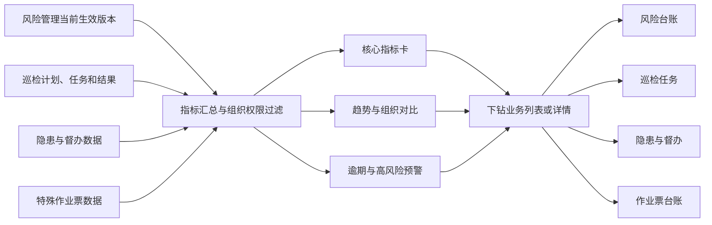

# 9. 管理驾驶舱模块 PRD

## 9.1 模块概述

### 9.1.1 模块定位

管理驾驶舱是安全管理平台的管理观察层，面向集团领导、公司领导和安全管理人员展示风险、巡检、隐患、督办和特殊作业的当前态势、趋势、对比和预警。驾驶舱只负责汇总、下钻和预警，不替代风险审核、隐患整改、督办反馈或作业审批等业务操作。

驾驶舱按“组织基础角色 + 业务流程岗位”过滤数据；仅提供只读下钻，不改变业务状态。平台管理员也不得在驾驶舱代办任何业务审批、复核、验收或关闭。

### 9.1.2 模块组成

| 序号 | 子模块 | 核心职责 | 面向角色 |
|---|---|---|---|
| 1 | 核心指标卡 | 展示风险点、隐患、闭环率、活跃作业、证书临期和督办数量 | 管理层 |
| 2 | 风险态势 | 风险四色图、等级分布和高风险区域 | 管理层 / 安环 |
| 3 | 隐患趋势 | 新增、整改、关闭、逾期和重大隐患趋势 | 管理层 |
| 4 | 组织对比 | 按公司/分公司/作业区对比安全指标 | 集团领导 / 集团监督检查 |
| 5 | 动态信息 | 未完成作业票、逾期隐患、督办进度、证书临期、PC/移动统一待办和来源分流结果 | 管理层 / 安环 |
| 6 | 穿透下钻 | 从指标到组织、风险点、隐患和作业票详情 | 授权用户 |

### 9.1.3 模块内部关系

```
风险、巡检、隐患、督办、特殊作业业务数据
                    │
                    ▼
             指标计算与权限过滤
                    │
        ┌───────────┼───────────┐
        ▼           ▼           ▼
     KPI卡片      趋势图       组织对比
        │           │           │
        └───────────┴───────────┘
                    │ 点击下钻
                    ▼
             业务列表/详情页面
```

### 9.1.4 与其他模块的依赖关系

| 数据来源 | 驾驶舱内容 | 访问方式 |
|---|---|---|
| 风险管理 | 风险点总数、各等级数量、四色图和版本变化 | 读取当前正式版本 |
| 巡检任务 | 计划完成率、漏检率、不合格率 | 按组织和周期聚合 |
| 隐患治理 | 新增、待整改、逾期、关闭、平均整改时长、四类来源、随手拍奖励和专业检查罚款 | 读取隐患状态、来源和时间线 |
| 集团督办 | 活跃督办、逾期督办、反馈完成率 | 独立统计督办状态 |
| 特殊作业 | 活跃作业票、审批中、监护中、超时作业 | 读取作业票状态 |
| 组织权限 | 集团/公司/作业区穿透范围 | 过滤所有指标和下钻 |

### 9.1.5 数据汇总与下钻关系图



说明：驾驶舱只读汇总和下钻，不改变业务单据状态，也不提供代办审批、整改或关闭动作。

## 9.2 指标定义

| 指标 | 计算口径 | 默认周期 |
|---|---|---|
| 风险点总数 | 当前有效风险点数量 | 当前快照 |
| 重大/较大风险 | 当前正式版本等级为对应等级的风险点数 | 当前快照 |
| 隐患总数 | 查询周期内创建的隐患数 | 本月 |
| 待处置隐患 | 当前状态为待受理、待整改、整改中的隐患数 | 当前快照 |
| 逾期隐患 | deadline 已过且未关闭的隐患数 | 当前快照 |
| 隐患闭环率 | 周期内关闭隐患 / 周期内登记隐患 | 本月 |
| 巡检完成率 | 已完成任务 / 应完成任务 | 本月 |
| 活跃作业票 | 当前未完成作业票数（待审批、审批中、待监护确认、待开工、作业中、暂停中） | 当前快照 |
| 集团督办 | 未关闭督办数 | 当前快照 |
| 平均整改时长 | 从受理到关闭的平均小时数 | 本月 |
| 证书临期/过期 | 按培训与证书模块当前证书版本和配置预警窗口统计临期、过期证书数量 | 当前快照；点击下钻证书管理并带入状态筛选 |
| 班组参与率 | 统计期内至少提交一条有效自主隐患的班组数 ÷ 应参与班组数 | 本月 |
| 随手拍奖励 | 统计期内已闭环随手拍的奖励金额/笔数 | 本月 |
| 专业检查罚款 | 统计期内集团专业检查已闭环台账的罚款金额/笔数 | 本月 |

指标口径必须在系统中可查看，不能只显示一个没有定义的数字。

## 9.3 页面布局

```
┌───────────────────────────────────────────────────────────┐
│ 组织选择  时间范围  数据更新时间             全屏/刷新     │
├───────────────────────────────────────────────────────────┤
│ 风险点 │ 重大风险 │ 待处置隐患 │ 逾期隐患 │ 活跃作业 │ 督办 │
├───────────────────────────┬───────────────────────────────┤
│ 风险四色图/区域态势         │ 隐患月度趋势/闭环趋势          │
├───────────────────────────┼───────────────────────────────┤
│ 各组织指标对比              │ 活跃作业票/督办动态            │
└───────────────────────────┴───────────────────────────────┘
```

## 9.4 功能清单

| 编号 | 功能点 | 操作 | 说明 | 权限 |
|---|---|---|---|---|
| F-DASH-01 | 组织切换 | 查询 | 集团、公司、分公司、作业区逐级切换 | 按数据权限 |
| F-DASH-02 | 时间范围 | 查询 | 今日、本周、本月、本季度、自定义 | 授权用户 |
| F-DASH-03 | KPI 卡片 | 查看/下钻 | 点击指标进入对应列表，并带入筛选条件 | 管理层 |
| F-DASH-04 | 风险四色图 | 查看/下钻 | 点击区域或风险点查看风险详情 | 管理层 / 安环 |
| F-DASH-05 | 隐患趋势 | 查看/下钻 | 查看新增、整改、关闭和逾期趋势 | 管理层 |
| F-DASH-06 | 组织对比 | 查看/排序 | 比较各组织隐患、闭环率、巡检完成率和风险等级 | 集团领导 |
| F-DASH-07 | 动态信息 | 查看/跳转 | 未完成作业、督办、逾期隐患和证书临期事项滚动展示，点击进入业务详情 | 授权用户 |
| F-DASH-08 | 数据刷新 | 操作 | 手动刷新和定时刷新，显示数据更新时间 | 授权用户 |
| F-DASH-09 | 全屏展示 | 操作 | 适配管理大屏；隐藏非必要导航 | 管理层 |
| F-DASH-10 | 指标说明 | 查看 | 展示指标口径、统计时间和数据源 | 授权用户 |

## 9.5 业务规则

| 编号 | 规则 |
|---|---|
| BR-DASH-01 | 所有指标先按用户组织数据权限过滤，再进行统计；集团可看全局，公司只能看本公司及下属范围 |
| BR-DASH-02 | 风险指标只读取已生效版本；草稿和历史版本不进入正式态势统计 |
| BR-DASH-03 | 逾期判断统一由后端按业务期限和当前时间计算，前端不自行判断 |
| BR-DASH-04 | 驾驶舱下钻必须进入真实业务列表或详情，不允许只弹出静态演示信息 |
| BR-DASH-05 | 数据更新时间和统计周期必须明确显示；接口异常时显示数据不可用，不展示伪造的 0 |
| BR-DASH-06 | 督办指标只统计督办单状态，不用原隐患状态替代督办状态 |
| BR-DASH-07 | 活跃作业票只统计未完成状态；已完工和已归档作业不进入活跃作业指标 |
| BR-DASH-08 | 班组参与率采用隐患模块统一口径，巡检自动转入和历史导入数据不计入自主隐患 |
| BR-DASH-09 | 驾驶舱不提供业务审批、整改关闭或作业开工按钮；可提供进入业务页面的跳转入口 |
| BR-DASH-10 | 驾驶舱动态待办只读展示 PC 工作台与移动端共用的待办状态；办理必须进入对应业务页面，不得在驾驶舱代办 |

## 9.6 接口清单

| Method | 路径 | 说明 |
|---|---|---|
| GET | `/api/v1/dashboard/summary` | KPI 汇总 |
| GET | `/api/v1/dashboard/risk-distribution` | 风险等级/区域分布 |
| GET | `/api/v1/dashboard/hazard-trend` | 隐患趋势和闭环趋势 |
| GET | `/api/v1/dashboard/org-comparison` | 组织横向对比 |
| GET | `/api/v1/dashboard/active-work` | 活跃特殊作业 |
| GET | `/api/v1/dashboard/supervision-dynamic` | 督办动态 |
| GET | `/api/v1/dashboard/alerts` | 逾期和高风险预警 |
| GET | `/api/v1/dashboard/certificate-alerts` | 证书临期和过期统计 |
| GET | `/api/v1/dashboard/team-participation` | 班组自主隐患参与率 |
| GET | `/api/v1/dashboard/metric-definitions` | 指标口径 |

## 9.7 页面清单

| 页面名称 | 路由 | 说明 |
|---|---|---|
| 管理驾驶舱 | `/dashboard` | PC 综合态势页 |
| 驾驶舱全屏 | `/dashboard/fullscreen` | 管理大屏 |
| 风险下钻 | `/dashboard/drilldown/risk` | 带组织和等级筛选进入风险台账 |
| 隐患下钻 | `/dashboard/drilldown/hazard` | 带状态和日期筛选进入隐患台账 |
| 作业下钻 | `/dashboard/drilldown/work` | 带状态筛选进入特殊作业台账 |

## 9.8 非功能与验收

- 首屏核心指标加载 P95 ≤ 2 秒；趋势和组织对比可异步加载。
- 支持手动刷新和 30–60 秒定时刷新，显示最后更新时间。
- 大屏连续运行 8 小时不出现明显内存增长或图表失效。
- 必须完成“点击重大风险→风险台账、点击逾期隐患→隐患列表、点击活跃作业→作业票详情、点击证书临期→证书台账”的下钻验收。
- 当前项目状态：原演示系统已有集团驾驶舱和风险地图；真实聚合接口、权限过滤和实时刷新尚待建设。
