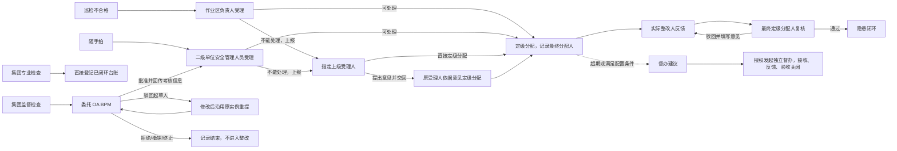

# 7. 隐患治理与督办模块 PRD

## 7.1 模块概述

### 7.1.1 模块定位

隐患治理与督办模块负责安全隐患从发现、登记、受理、分派、整改、复查到闭环归档的全过程管理；本级无法处理时，在受理阶段上报，上级可直接定级分配或提出意见交回原受理人办理。另提供逾期隐患的独立督办建议和督办单据。上报解决受理阶段本级无法处理的问题，督办监督整改进度；上级处理完成或督办关闭均不能替代原隐患关闭。

本模块采用“组织基础角色 + 业务流程岗位”授权：集团专业检查仅负责通过独立页面录入已经完成整改的专业检查台账，并查看同一专业部门下的专业检查记录，提交即闭环且不展示 OA；集团监督检查负责监督检查、将审批跨系统委托给 OA 内置 BPM 和督办；巡检来源由作业区负责人受理，整改反馈由整改责任人提交，复核由最终定级分配人办理。平台管理员只维护配置和岗位映射，不得代办受理、复查、验收、督办关闭或奖励/罚款确认。

隐患正式等级只设置“一般隐患、重大隐患”两级。登记后至实际分派整改前可处于“未定级”，包括受理岗位尚未定级即上报的情况；未定级不是第三种等级。重大隐患的定级确认和重点管控提示不等于“上报”：一般隐患也可因本级无法解决而上报，上报不自动改变等级。

### 7.1.2 模块组成

| 序号 | 子模块 | 核心职责 | 面向角色 |
|---|---|---|---|
| 1 | 隐患登记 | 巡检、移动端随手拍、集团专业检查台账、集团监督检查四类来源分流 | 对应来源角色 |
| 2 | 受理与上报 | 直接定级分配或上报；上级直接分配或提出意见交回原受理人 | 当前受理人 / 指定上级 |
| 3 | 整改执行 | 实际整改人填写整改情况说明并上传整改后照片，驳回后重新整改 | 实际整改人 |
| 4 | 复核闭环 | 最终定级分配人复核，合格关闭，不合格填写意见驳回整改 | 最终定级分配人 |
| 5 | 督办流转 | 逾期生成建议，授权人员发起、接收、反馈、催办和关闭 | 授权监督人员 / 责任组织 |
| 6 | 统计预警 | 逾期、重大、重复和闭环率统计 | 管理层 |

### 7.1.3 模块内部关系

隐患治理：登记 → 受理（直接定级分配，或上报后由上级分配/提出意见交回）→ 实际整改人反馈 → 最终定级分配人复核 → 关闭或驳回整改。专业检查直接登记已闭环；监督检查先 OA 批准再进入受理。督办与隐患分别流转、互相关联。

### 7.1.4 与其他模块的依赖关系

| 依赖模块 | 依赖内容 | 依赖方式 |
|---|---|---|
| 巡检任务 | 不合格检查项、照片、风险来源 | 自动生成隐患草稿或带入登记表 |
| 风险管理 | 风险点、危险源、风险等级和措施 | 关联隐患来源，支持风险穿透 |
| 特殊作业 | 作业票、作业现场异常 | 作业过程中可登记隐患 |
| 组织权限 | 所属公司、责任部门、人员 | 数据范围和整改分派 |
| 企业微信待办 | 受理、上报、提出意见交回、整改、复核、逾期、督办提醒 | PC/移动端共用同一业务待办；审批待办由内置 BPM 生成，企业微信承接通知；OA 内部待办不重复生成 |

### 7.1.5 核心业务流转图



说明：集团专业检查不走 OA，录入时记录考核责任人和罚款；提交后直接以“已闭环”状态保存为专业检查隐患台账，仅允许同专业部门查看，不产生受理、分派、整改、复查、督办或 OA 待办。集团监督检查审批不使用安全管理平台 BPM 服务，而是跨系统调用 OA 内置 BPM 流程启动入口，将流程完整委托给 OA；平台不展示 OA 流程节点，不创建平台 BPM 审批任务。OA 返回实例编号和审批状态跳转链接，仅在驳回起草人及最终结束时回传，并在结束回调中返回考核人、考核金额和结果。督办关闭不代替普通隐患关闭。

## 7.2 数据模型

### 7.2.1 hazard — 隐患主单

| 字段 | 类型 | 必填 | 说明 |
|---|---|:---:|---|
| id | bigint PK | ✓ | 主键 |
| hazard_code | varchar(64) UNIQUE | ✓ | 隐患编号：`HZ-YYYYMMDD-NNN` |
| org_id | bigint FK | ✓ | 所属公司/组织 |
| source_type | varchar(32) | ✓ | `INSPECTION` 巡检、`MOBILE_REPORT` 随手拍、`PROFESSIONAL_DEPT_CHECK` 集团专业检查、`HSE_SUPERVISION` 集团监督检查 |
| source_id | bigint | — | 来源业务单据 |
| source_org_id | bigint FK | ✓ | 来源组织/检查部门 |
| professional_dept_id | bigint FK | 条件必填 | 专业检查来源的专业部门；用于限定集团专业检查的数据查看范围 |
| risk_id / hazard_source_id | bigint FK | — | 关联风险点和危险源 |
| title | varchar(200) | ✓ | 隐患标题；巡检来源固定取对应不合格检查项的“说明” |
| description | text | ✓ | 事实描述、位置和发现过程 |
| location | varchar(200) | ✓ | 具体位置 |
| severity | varchar(32) | 条件必填 | 正式值仅允许 `GENERAL` 一般隐患、`MAJOR` 重大隐患；待受理及未完成定级而提请上报时允许为空，实际分派整改前必须确认 |
| responsible_dept | varchar(128) | — | 整改责任部门 |
| responsible_user_id | bigint FK | 条件必填 | 整改责任人；普通隐患受理分派时必填，专业检查台账登记已完成整改的责任人 |
| deadline | datetime | 条件必填 | 整改期限；普通受理或确认定级分配时必填，上报不要求先填；已有期限不得因上报清空。专业检查台账登记历史整改期限 |
| assessment_responsible_user_id | bigint FK | 条件必填 | 集团专业检查录入时必填；集团监督检查在 OA 最终批准回调时写入 |
| penalty_amount | decimal(12,2) | 条件必填 | 集团专业检查录入时填写；集团监督检查在 OA 最终批准回调时写入；无罚款记录 0 |
| oa_workflow_instance_id | varchar(128) | 条件必填 | 集团监督检查跨系统委托 OA BPM 后返回的实例；监督来源必填，驳回起草人后重新提交沿用原实例 |
| oa_status_url | varchar(1000) | 条件必填 | OA BPM 返回的审批状态跳转链接；点击平台“审批中”状态在新窗口打开 |
| oa_sync_status | varchar(32) | ✓ | `NOT_REQUIRED`、`PENDING`、`SYNCED`、`FAILED` |
| reward_eligible | tinyint | ✓ | 仅随手拍闭环后可为 1；巡检固定为 0 |
| reward_amount | decimal(12,2) | — | 随手拍闭环奖励金额，按制度计算 |
| reward_status | varchar(32) | — | `NOT_APPLICABLE`、`PENDING`、`CALCULATED`、`PAID` |
| status | varchar(32) | ✓ | 隐患主状态，含 `PENDING_UPPER_ACCEPTANCE` 待上级受理；见 §7.3 |
| first_acceptor_id / current_acceptor_id | bigint FK | 条件必填 | 首次受理人及当前受理人分别记录；上报后当前受理人为指定上级，交回后为原受理人 |
| final_assigner_id / reviewer_id | bigint FK | 条件必填 | 成功定级分配时记录实际办理人；复核人自动等于最终分配人，不能另行指定 |
| current_report_id | bigint FK | 条件必填 | 当前上报记录引用；记录上级处理意见和结果 |
| reporter_user_id | bigint FK | ✓ | 发现人 |
| created_at / closed_at | datetime | ✓ | 创建和关闭时间 |

### 7.2.2 hazard_action — 隐患操作记录

| 字段 | 类型 | 必填 | 说明 |
|---|---|:---:|---|
| id | bigint PK | ✓ | 主键 |
| hazard_id | bigint FK | ✓ | 隐患 |
| action_type | varchar(32) | ✓ | 登记、受理、上报、提出意见并交回、定级分配、不受理关闭、整改提交、复核通过、复核驳回、关闭 |
| operator_user_id | bigint FK | ✓ | 操作人 |
| action_note | text | 条件必填 | 上报原因和事项；上级处理意见；复核通过/驳回意见均保留 |
| before_deadline / after_deadline | datetime | 条件必填 | 定级分配调整期限时记录原、新值；原期限未设置时原值为空 |
| before_assignee_id / after_assignee_id | bigint FK | 条件必填 | 整改责任人变更时记录前后责任人 |
| before_status / after_status | varchar(32) | — | 状态前后值 |
| action_at | datetime | ✓ | 操作时间 |

### 7.2.3 hazard_rectification — 整改反馈

| 字段 | 类型 | 必填 | 说明 |
|---|---|:---:|---|
| id | bigint PK | ✓ | 主键 |
| hazard_id | bigint FK | ✓ | 隐患 |
| rectification_summary | text | ✓ | 一项“整改情况说明”，同时描述采取的措施和实际完成结果 |
| completed_at | datetime | ✓ | 整改完成时间 |
| evidence_ids | json | ✓ | 整改后照片；发现阶段证据保留在隐患主单，巡检来源直接带入不合格项照片 |
| submitter_user_id | bigint FK | ✓ | 提交人 |
| review_result | varchar(32) | — | 待复查、通过、不通过 |
| review_note | varchar(1000) | — | 复查意见 |

### 7.2.4 hazard_supervision — 督办单

| 字段 | 类型 | 必填 | 说明 |
|---|---|:---:|---|
| id | bigint PK | ✓ | 主键 |
| supervision_code | varchar(64) UNIQUE | ✓ | 督办编号：`SUP-YYYY-NNN` |
| hazard_id | bigint FK | ✓ | 关联原隐患 |
| source_org_id | bigint FK | ✓ | 发起组织 |
| target_org_id | bigint FK | ✓ | 被督办公司 |
| supervision_level | varchar(32) | ✓ | 组织级、专项、逾期升级 |
| opinion | text | ✓ | 督办意见和要求 |
| deadline | datetime | ✓ | 督办期限 |
| status | varchar(32) | ✓ | 草稿、已发起、已接收、反馈中、待验收、已关闭；关闭可由授权人员手动完成 |
| created_by / created_at | — | ✓ | 审计字段 |

### 7.2.5 supervision_feedback — 督办反馈

| 字段 | 类型 | 必填 | 说明 |
|---|---|:---:|---|
| id | bigint PK | ✓ | 主键 |
| supervision_id | bigint FK | ✓ | 督办单 |
| progress_percent | decimal(5,2) | ✓ | 进度百分比 |
| feedback_text | text | ✓ | 阶段进展、困难和下一步 |
| evidence_ids | json | — | 反馈附件 |
| feedback_by / feedback_at | — | ✓ | 反馈人和时间 |

### 7.2.6 hazard_report — 受理上报记录

| 字段 | 必填 | 说明 |
|---|:---:|---|
| id / hazard_id | ✓ | 上报记录及原隐患；沿用原隐患编号 |
| from_user_id / from_role / reported_at | ✓ | 原受理人、岗位及上报时间 |
| target_user_id / target_role | ✓ | 指定上级受理人及岗位 |
| reason / requested_matters | ✓ | 上报原因、需解决事项 |
| result | ✓ | 待上级受理、上级已分配、已提出意见交回 |
| opinion / handled_by / handled_at | 条件必填 | 上级处理意见、实际办理人及时间 |
| workflow_instance_id / task_id | 条件必填 | 系统内置 BPM 对应实例和任务引用，不自行保存另一套审批路径 |

上报不重复创建隐患。上级办理后原上级待办结束；直接分配生成整改待办，提出意见交回则生成原受理人的定级分配待办。重复提交不得重复生成记录或待办。

## 7.3 状态流转

### 7.3.1 隐患流转

| 状态 | 后续操作 |
|---|---|
| REPORTED 待受理 | 当前受理人定级分配或上报；不受理关闭仅为原有例外，不能因解决不了而关闭 |
| PENDING_UPPER_ACCEPTANCE 待上级受理 | 指定上级直接分配或提出意见交回 |
| ASSIGNED 待整改 | 实际整改人执行并反馈 |
| RECTIFYING 整改中 | 初次执行或复核驳回后继续整改，提交后待复核 |
| PENDING_REVIEW 待复核 | 最终定级分配人通过关闭或驳回整改 |
| CLOSED 已闭环 | 查看历史，不继续流转 |
| REJECTED_AT_ACCEPTANCE 不受理关闭 | 保存原因，与整改完成区分 |

上级提出意见交回恢复“待受理”，显示“依据上级意见定级分配”，不是退回补充材料。逾期为独立预警标识，不覆盖主状态；没有整改期限时不虚构逾期，驳回不自动延期。OA 状态仍按原四种最终结果及驳回起草人规则处理。

### 7.3.1a 受理上报与复核责任

受理是隐患主流程的一部分，不另设“上级协调”分支。谁最终定级分配，谁负责复核；首次受理人、当前受理人、最终定级分配人及整改人分别记录，不得混用。

1. 首次受理：巡检由所属作业区负责人；随手拍及 OA 批准后的集团监督检查由所属二级单位安全管理人员。集团专业检查直接登记已闭环台账，不进入本流程。
2. 受理人能够处理时直接定级分配；不能处理时填写上报原因、需解决事项，选择上级受理人。作业区负责人可报二级单位安全管理人员，二级单位安全管理人员可报二级单位领导。未确定整改人、期限或等级时仍可上报，不得为上报随意填写。
3. 上报后为“待上级受理”，上级仅有两种业务操作：直接定级分配；或填写处理意见并交回原受理人定级分配。不提供继续上报、退回补充材料等额外分支。
4. 上级直接分配后，上级成为最终定级分配人和复核人；上级提出意见交回后，恢复原受理人的待受理任务（显示“依据上级意见定级分配”），由原受理人完成分配并复核。交回不是驳回整改，不清空上级意见，不要求重新登记。
5. 分配提交时必填等级（一般/重大）、责任部门、在职整改人、有效整改期限、整改要求；上级直接分配须填写处理意见。原受理意见可引用常用语再修改；原等级、上级意见默认带入，部门默认由整改人所属部门带出。
6. 成功分配后为“待整改”，复核人由最终分配操作人自动确定，不另提供任意选择框，不固定为作业区负责人，也不自动交给 OA 审批人。
7. 实际整改人填写整改情况说明并上传整改后照片，提交为“待复核”；复核人必须填写意见，通过后“已闭环”，不通过为“整改中”并交回原整改人。再次反馈仍由同一最终分配人复核。
8. 上报、交回和复核驳回均不自动改变等级或期限，不覆盖原证据；历次整改反馈与复核意见按次保留。当前不增加整改人上报、整改期间再上报、更换分配人或自动延期的分支。
9. 人员来自 OA 同步在职目录，平台岗位和组织权限决定可选范围。只有当前受理人可定级分配/上报，仅指定上级可处理上报，仅最终分配人可复核；同岗位不等于能代办。无人可选时提示岗位配置，不默认转给管理员。
10. 审批相关节点统一使用系统内置 BPM，隐患模块不自建流程引擎；集团监督检查的前置 OA 审批例外不变。上报不是再次发起 OA。

| 人员 | 办理内容 | 复核责任 |
|---|---|---|
| 首次/原受理人 | 直接分配，或上报；收到上级意见后完成分配 | 本人最终分配时承担 |
| 指定上级受理人 | 直接分配，或提出意见并交回 | 直接分配时承担；仅提意见不承担 |
| 实际整改人 | 本人隐患整改反馈、按驳回意见重新整改 | 不因整改获得复核权 |
| 授权督办人员 | 督办发起、跟踪、反馈验收 | 不因督办获得隐患复核权 |
| 管理员及其他人员 | 按权限配置或查看 | 不得代办 |

```text
待受理 → 定级分配 → 待整改 → 整改反馈 → 待复核 → 通过 → 已闭环
待受理 → 上报 → 待上级受理 → 上级直接定级分配 → 待整改（上级负责复核）
待上级受理 → 提出意见并交回 → 原受理人定级分配 → 待整改（原受理人负责复核）
待复核 → 驳回并填写意见 → 整改中 → 再次反馈 → 待复核（仍由最终分配人复核）
```

### 7.3.2 督办流转

```
DRAFT → ISSUED → RECEIVED → FEEDBACKING → PENDING_ACCEPTANCE → CLOSED
                  │             │                 │
                  └──拒收/补充───┴────退回──────────┘
```

## 7.4 功能清单

| 编号 | 功能点 | 操作 | 说明 | 权限 |
|---|---|---|---|---|
| F-HZ-01 | 登记隐患 | 新增 | 普通登记入口只提供随手拍和集团监督检查；巡检由不合格项自动转入；集团专业检查使用独立“专业检查台账”新增页面 | 对应来源角色 |
| F-HZ-01b | 专业检查已闭环台账 | 新增/查询 | 完整登记检查部门/检查人/时间、问题、位置、等级、整改部门/责任人/期限、受理人/时间、整改闭环说明/时间/照片、考核责任人/金额/依据；提交即闭环，不展示 OA | 集团专业检查 |
| F-HZ-01a | 隐患台账展示 | 查询 | 台账至少展示编号、标题、位置、来源、等级、责任人、期限和状态；位置不得只藏在详情中 | 授权查看人员 |
| F-HZ-02 | 隐患受理 | 操作 | 受理分派时确认等级、责任部门、责任人、期限和整改要求；可不受理并填写关闭原因，或本级无法处理时上报，不能用不受理关闭代替上报。重大隐患定级确认与上报操作分开 | 对应来源受理岗位 |
| F-HZ-03 | 定级分配 | 操作 | 确定一般/重大、责任部门、整改人、期限、要求；记录最终分配人并自动绑定其为复核人 | 当前受理人 |
| F-HZ-03a | 受理上报 | 操作 | 本级无法处理时填写原因和事项，选择上级，状态变为待上级受理；不新增隐患 | 首次受理人 |
| F-HZ-03b | 上级受理 | 操作 | 直接定级分配，或提出意见并交回原受理人完成定级分配；无继续上报和退回补充入口 | 指定上级受理人 |
| F-HZ-03c | 上报记录查询 | 查询 | 查看上报原因、上级意见、当前受理人、最终分配人及复核人 | 授权查看人员 |
| F-HZ-04 | 整改反馈 | 操作 | 填写一项整改情况说明并上传整改后照片；整改前照片从来源记录自动带入 | 整改责任人 |
| F-HZ-05 | 整改复核 | 操作 | 最终定级分配人填写意见，通过后闭环，不通过交原整改人重新整改 | 最终定级分配人 |
| F-HZ-05a | 受理常用语 | 配置/引用 | 受理页面提供 2—3 条可维护常用整改要求，点击带入后仍可修改 | 受理岗位 |
| F-HZ-06 | 隐患时间线 | 查看 | 展示全部状态变化、意见、附件和操作人 | 授权用户 |
| F-HZ-07 | 督办发起 | 新增 | 从逾期督办建议中选择隐患，填写督办意见和期限，指定责任组织 | 授权监督人员 |
| F-HZ-08 | 督办接收 | 操作 | 被督办组织确认接收、指定责任人和反馈计划 | 责任组织授权人员 |
| F-HZ-09 | 督办反馈 | 新增 | 支持多次进度反馈、阶段附件和困难说明 | 被督办公司 |
| F-HZ-10 | 督办验收关闭 | 操作 | 发起组织核验反馈，关闭督办单；原隐患继续独立流转 | 发起组织授权人员 |
| F-HZ-11 | 逾期预警与督办建议 | 查看/推送 | 超过整改期限自动标红、提醒并生成督办建议；授权人员确认后发起督办 | 系统自动 / 授权人员 |
| F-HZ-12 | 统计分析 | 查看 | 隐患数量、闭环率、平均整改时长、逾期率、重复隐患、来源分布、奖励和罚款 | 管理层 |
| F-HZ-13 | 来源分流处理 | 操作 | 集团专业检查不走 OA，仅可登记和查看同一专业部门记录，记录考核责任人/罚款后提交即闭环；集团监督检查跨系统调用 OA BPM 启动入口并完整委托 OA，不调用系统内置 BPM；随手拍闭环计算奖励，巡检不计奖励 | 对应业务岗位 |

## 7.5 业务规则

| 编号 | 规则 |
|---|---|
| BR-HZ-01 | 除 `PROFESSIONAL_DEPT_CHECK` 提交即闭环台账外，隐患登记后必须经过受理判断。受理岗位可受理分派、不受理关闭，或在本级无法处理时上报；不能因无法承担整改就直接不受理关闭。发现人不得越权关闭 |
| BR-HZ-02 | 隐患正式等级只有一般隐患、重大隐患两级；受理岗位未完成定级就上报时可保留未定级，实际分派整改前必须二选一。重大隐患须显示定级确认和重点管控提示，是否作为督办条件按配置执行，不默认自动发起督办；上报不自动将一般隐患改为重大隐患 |
| BR-HZ-03 | 整改反馈只保留“整改情况说明”和整改后照片两个核心输入；提交后由最终定级分配人复核。复查意见必填，不通过必须回到整改状态 |
| BR-HZ-04 | 逾期是预警维度，不覆盖隐患主状态；关闭后不再显示为逾期 |
| BR-HZ-05 | 督办与原隐患状态独立；督办关闭不会自动关闭隐患，隐患关闭也不自动关闭督办；督办可在隐患闭环前或后手动关闭 |
| BR-HZ-06 | 同一巡检结果、同一现场上报不得重复生成相同隐患；系统需提供相似隐患提示 |
| BR-HZ-07 | 所有状态变化、责任人变化、期限变化和审核意见必须进入时间线 |
| BR-HZ-08 | 班组参与率 = 统计期内至少提交一条有效自主隐患的班组数 ÷ 应参与班组数；巡检自动转入和历史导入数据不计入自主隐患 |
| BR-HZ-09 | 隐患来源只允许 `INSPECTION`、`MOBILE_REPORT`、`PROFESSIONAL_DEPT_CHECK`、`HSE_SUPERVISION` 四类；来源登记后不可修改，统计和权限按来源分流 |
| BR-HZ-10 | `INSPECTION` 巡检隐患不计奖励；`MOBILE_REPORT` 随手拍仅在隐患闭环后按制度计算奖励，奖励计算、审批和发放均留痕 |
| BR-HZ-11 | `PROFESSIONAL_DEPT_CHECK` 仅允许集团专业检查在独立页面录入；该角色仅可查看 `professional_dept_id` 与本人所属专业部门一致的记录。一期不展示或发起 OA，必须一次性登记发现、整改、闭环和考核字段（无罚款也记录 0 和原因），提交后直接置为 `CLOSED`，不生成受理、分派、整改、复查、督办或 OA 待办 |
| BR-HZ-12 | 巡检来源隐患按不合格检查项逐条生成；隐患标题等于该项巡检说明，位置取巡检任务现场位置或检查项关联风险位置，发现照片取该项照片字段；不得以检查标准名称替代巡检说明作为标题 |
| BR-HZ-13 | `HSE_SUPERVISION` 仅允许集团监督检查发起，审批必须跨系统调用 OA 内置 BPM 流程启动入口，并将流程完整委托 OA；不得调用或创建安全管理平台 BPM 流程。隐患保存 OA 实例号、审批状态链接、驳回起草人原因和最终处理结果，平台不展示 OA 节点。驳回起草人后在平台修改并沿用原实例重提；批准回调必须带回考核人和考核金额，然后由被检查二级单位安全管理人员受理、选择整改责任人和期限。集团监督检查不承担受理和整改；拒绝、撤销、终止只记录最终结果，不进入整改闭环 |

受理上报补充规则：

| 编号 | 规则 |
|---|---|
| BR-HZ-14 | 上报仅在受理阶段；当前受理人无法处理时提交指定上级。上级仅直接定级分配或提出意见交回原受理人，不扩展独立协调、多级连续上报或整改人申请协调 |
| BR-HZ-15 | 上报前不强制先定级、填写整改人或期限；实际定级分配时必须补齐，并将最终办理人绑定为复核人 |
| BR-HZ-16 | 上级提出意见交回恢复原受理人的待受理任务；原受理人依据意见分配后负责复核，不交由上级复核。直接上级分配的，由该上级复核 |
| BR-HZ-17 | 上报、交回及复核驳回不自动改变等级或期限，不覆盖原证据；每次整改反馈和复核意见按轮次保留。督办关闭不代替隐患复核 |
| BR-HZ-18 | 待上级受理计入未闭环；每一步只有当前受理人、实际整改人或最终分配人可办理对应动作，重复请求不得重复建单或产生重复有效待办 |

## 7.6 接口清单

| Method | 路径 | 说明 |
|---|---|---|
| POST/GET | `/api/v1/hazards` | 登记/查询隐患 |
| POST | `/api/v1/hazards/professional-dept-check` | 登记集团专业检查隐患，记录考核责任人和罚款金额，提交即闭环且不调用 OA |
| POST | `/api/v1/hazards/hse-supervision` | 登记集团监督检查并跨系统调用 OA BPM 流程启动入口；不创建平台 BPM 流程，返回 OA 实例号和审批状态链接 |
| POST | `/api/v1/hazards/{id}/oa-callback` | 接收驳回起草人或批准、拒绝、撤销、终止最终结果；最终回调包含考核人和考核金额 |
| POST | `/api/v1/hazards/{id}/oa-resubmit` | 起草人修改后基于原 OA 实例重新提交 |
| GET | `/api/v1/hazards/{id}` | 隐患详情、时间线、附件和整改记录 |
| POST | `/api/v1/hazards/{id}/accept` | 受理并定级 |
| POST | `/api/v1/hazards/{id}/assign` | 当前受理人定级分配，记录最终分配人并自动绑定复核人；上级可直接办理，原受理人可依据交回意见办理 |
| POST | `/api/v1/hazards/{id}/report` | 首次受理人上报指定上级，保留原隐患及来源资料 |
| POST | `/api/v1/hazards/{id}/reports/{reportId}/return-with-opinion` | 指定上级提出意见并交回原受理人完成定级分配，不是退回补充材料 |
| GET | `/api/v1/hazards/{id}/reports` | 按隐患查看权限返回上报及上级意见记录 |
| POST | `/api/v1/hazards/{id}/rectification` | 提交整改反馈 |
| POST | `/api/v1/hazards/{id}/review` | 仅最终定级分配人可复核，通过关闭或驳回原整改人；记录本轮意见 |
| GET | `/api/v1/hazards/statistics` | 隐患统计 |
| GET | `/api/v1/hazards/{id}/reward` | 查询随手拍闭环奖励计算和发放状态（巡检来源返回不适用） |
| POST/GET | `/api/v1/supervisions` | 发起/查询督办单 |
| POST | `/api/v1/supervisions/{id}/receive` | 接收督办 |
| POST | `/api/v1/supervisions/{id}/feedback` | 提交阶段反馈 |
| POST | `/api/v1/supervisions/{id}/close` | 督办验收关闭 |
| GET | `/api/v1/supervisions/{id}/timeline` | 督办时间线 |

## 7.7 页面清单

| 页面名称 | 路由 | 说明 |
|---|---|---|
| 隐患治理与督办 | `/hazards` | 台账含位置、当前受理人、整改人、最终分配人/复核人；待上级受理筛选和上报/上级受理操作 |
| 隐患详情 | `/hazards/:id` | 登记、上报及上级意见、定级分配、历次整改反馈和复核、关联督办，体现各具体办理人 |
| 受理/上报/上级受理弹窗 | 沿用台账和详情，不新增菜单 | 直接定级分配或上报；上级直接分配或提出意见交回；校验失败保留输入，普通弹窗点击外部不关闭 |
| 专业检查台账 | `/hazards/professional` | 集团专业检查独立查询和已闭环台账新增页面 |
| 督办详情 | `/supervisions/:id` | 督办意见、接收、反馈和关闭 |
| 移动隐患上报 | `/mobile/hazards/create` | 随手拍、位置、等级和描述 |

## 7.8 非功能与验收

- 隐患状态变更和时间线写入必须同一事务完成。
- 受理上报、提出意见交回、定级分配、整改和复核时，业务状态、具体办理人、操作记录及待办一致更新；不得越权、重复操作或跳过节点。
- 附件上传失败不得丢失表单内容；发现阶段照片与整改后照片/视频应支持对比查看。
- 必须完成“巡检不合格→作业区负责人受理分派→整改情况说明和整改后照片→最终定级分配人复核通过→关闭”的浏览器验收，并验证不受理关闭分支及原因留痕。
- 必须完成“逾期隐患→督办建议→授权人员发起→责任组织接收→两次反馈→督办关闭，但原隐患仍独立可查”的验收。
- 必须分别验收随手拍闭环奖励、巡检不计奖励、集团专业检查记录考核责任人/罚款后提交即闭环且不走 OA、集团监督检查跨系统调用 OA BPM 启动入口并完整委托 OA、回传考核人/考核金额/最终结果四条分流路径。
- 必须验证登记或未定级即上报时可保留未定级；受理/确认定级分配前须选择一般或重大隐患。页面、筛选、统计和接口不得出现较大、特别重大等其他隐患等级。
- 当前项目状态：原演示系统有完整交互参考；生产后端和持久化尚待建设。

### 7.8.1 受理上报专项验收

| 编号 | 场景 | 验收结果 |
|---|---|---|
| AC-HZ-R01 | 首次受理人直接分配 | 字段完整后进入待整改；最终分配人与复核人为同一具体人员 |
| AC-HZ-R02 | 作业区上报安全管理人员，上级直接分配 | 不要求先填等级、整改人或期限；上级完成分配，复核待办交上级而非作业区负责人 |
| AC-HZ-R03 | 安全管理人员上报领导，领导直接分配 | 领导成为复核人，上级界面没有继续上报入口 |
| AC-HZ-R04 | 上级提出意见并交回 | 意见必填；原受理人看到意见并完成分配，后续由原受理人复核；不显示退回补充材料 |
| AC-HZ-R05 | 复核驳回再整改 | 原整改人重新反馈，旧照片及反馈保留，仍由最终分配人复核；不自动改期限 |
| AC-HZ-R06 | 越权、重复或缺字段操作 | 他人不得分配/整改/复核；缺必填项保持原状态，重复操作不重复建单或待办 |
| AC-HZ-R07 | 督办与来源边界 | 督办关闭不关闭隐患；专业检查已闭环台账无上报，监督检查仅 OA 批准后进入受理；审批中、整改中、待复核和结束状态无受理上报入口 |
