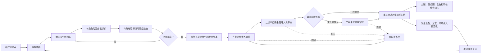

# 5. 安全管理平台风险管理模块 PRD

## 5.1 文档基准

本 PRD 以风险点整体闭环的最终业务规则为准。当前 PC 端原型的实际页面、字段、按钮和演示反馈仅用于交互参考，不把隐藏页面、未接入页面或后端预留能力写成本期已实现功能。

2026年9月20日评级规则修订：危险源 LEC 取值、分值说明及 D 值分级依据《LEC评价法取值表.xlsx》的“LEC取值标准”页；区间端点按“风险评价计算”页的分级公式明确，详见5.5.2。本次仅调整评级规则，不调整直接判定法、风险点整体审批路径及管控层级。

当前风险管理模块保留五个页签：

1. 风险总览
2. 风险台账
3. 风险四色图
4. 风险告知
5. 变更复评

当前原型为 PC 端本地演示页面，风险数据由统一前端状态仓库保存；本地演示数据可以通过状态仓库重置。真实后端接口、数据库审批流和正式版本发布服务不属于本次页面原型的已完成证明。

### 5.1.1 本期不展示的内容

以下内容不作为风险管理左侧菜单或风险总览入口：

- 辨识任务列表及任务审批待办；
- 风险告知卡的打印、二维码能力；
- 风险管理模块内的移动端风险地图；移动现场端仅保留“当前未完成作业票地图”，由移动现场端 PRD 定义。

风险辨识从“新建风险点”开始，不设置风险辨识任务。风险台账内部保留“班组长新建风险点 → 添加多条危险源 → 每条危险源分别评价并填写措施 → 提交整个风险点审核 → 批准生效”的交互。危险源不单独提交审批，全部危险源完成后统一随整个风险点提交。一般、低风险依次经过作业区负责人、二级单位安全管理人员审核后生效；较大、重大风险在上述节点后继续由二级单位领导审批，批准后生效。

首次双控报告导入不创建审批待办；导入前校验每个危险源的国标27类事故类型和必填管理措施，校验通过后导入文件作为风险点历史版本直接生效。后续新建、变更和复评均按整个风险点版本调用系统内置 BPM 微服务，不接入 OA，不生成风险审批 PDF。风险模块不自建审批路径、审批待办或审批状态机；任一 BPM 审批节点退回后统一回到班组长，班组长修改并重新提交时由 BPM 从作业区负责人审核重新开始。

## 5.2 模块菜单与页面关系

| 页签 | 路由参数 | 页面职责 |
|---|---|---|
| 风险总览 | `risks.html?tab=overview` | 展示风险点、重大/较大风险和管控措施的风险类汇总，并提供台账、四色图、告知入口 |
| 风险台账 | `risks.html?tab=ledger` | 查询风险点，班组长新增风险点，查看危险源和风险详情，发起风险点整体 BPM 审批，读取 BPM 返回的待办和审批状态 |
| 风险四色图 | `risks.html?tab=map` | 展示当前生效风险点位置、最高风险等级颜色和定位维护 |
| 风险告知 | `risks.html?tab=notice` | 在线查看当前生效版本的公告栏和岗位风险告知卡 |
| 变更复评 | `risks.html?tab=changes` | 对当前生效风险点发起变更或人工复评，按整个风险点生成新版本草稿并查看历史差异 |

旧的 `tab=tasks` 地址会回到风险台账，不再作为可见业务入口；`tab=changes` 为有效的变更复评入口。

### 5.2.1 核心业务流转图



说明：危险源不单独审批；审批、版本和发布均以整个风险点为对象。

## 5.3 风险总览

### 5.3.1 页面内容

风险总览只展示风险类数据，不显示任务或审批待办。

| 区域 | 展示内容 | 操作 |
|---|---|---|
| 风险点总数 | 当前生效风险点数量 | 点击进入风险台账 |
| 重大/较大风险 | 当前生效风险点中最高等级为重大或较大的数量 | 点击进入台账并筛选重大风险 |
| 管控措施总数 | 当前生效风险点下全部危险源措施数量 | 点击进入风险台账 |
| 风险点台账一览 | 编号、名称、作业区、危险源数量、最高等级、版本、状态 | 点击行进入风险台账详情 |
| 风险管理入口 | 查看风险台账、风险四色图、岗位风险告知卡、风险变更/人工复评 | 跳转对应页签 |
| 审批与导入状态 | BPM 当前节点、BPM 审批状态、首次双控导入标识 | 查询 BPM 审批留痕 |

### 5.3.2 总览统计规则

- 当前生效风险点：风险点存在当前版本且至少有一条危险源。
- 风险点最高等级：取该风险点危险源中的最高风险等级。
- 重大/较大风险：最高等级为“重大”或“较大”的风险点计数，每个风险点只计一次。
- 管控措施总数：统计当前生效版本全部危险源的措施记录数量。
- 总览不显示“危险源独立审批”“辨识任务”等内容；风险点审批状态统一在风险台账展示。
- 风险等级只影响风险点整体审批岗位，不改变危险源独立评价和措施必填要求。

## 5.4 风险台账

### 5.4.1 查询条件

风险台账顶部提供以下筛选条件：

| 条件 | 控件 | 取值/说明 |
|---|---|---|
| 编号 | 文本框 | 按风险点编号模糊查询 |
| 名称 | 文本框 | 按风险点名称模糊查询 |
| 组织 | 下拉框 | 全部、铸锻件分公司（含所属作业区）、智能加工配送中心 |
| 位置 | 文本框 | 按区域/位置模糊查询 |
| 类别 | 下拉框 | 全部、设备设施风险、作业活动风险、环境风险、管理风险 |
| 等级 | 下拉框 | 全部、重大、较大、一般、低 |
| 状态 | 下拉框 | 全部、草稿、已退回、待作业区负责人审核、待二级单位安全管理审核、待二级单位领导审批、管控中 |
| 版本 | 文本框 | 示例：`V1.0` |

按钮：

- **查询**：按当前条件刷新列表。
- **重置**：清空筛选条件并恢复全部数据。
- **新建风险点**：打开“新建风险点”宽抽屉。

### 5.4.2 台账表格

表格列必须保持以下顺序：

| 列 | 说明 |
|---|---|
| 编号 | 风险点编号，如 `RISK-ZX-001` |
| 名称 | 风险点名称 |
| 位置 | 具体位置 |
| 危险源数量 | 当前展示版本下危险源数量；点击数量打开详情 |
| 风险最高等级 | 取该风险点危险源最高等级，使用文字和颜色标签同时展示 |
| 版本 | 草稿版本或当前版本号 |
| 状态 | 草稿、已退回、待作业区负责人审核、待二级单位安全管理审核、待二级单位领导审批、管控中 |
| 操作 | 草稿由班组长发起审核；当前审核岗位查看/处理审核；退回后由班组长继续编辑并重新提交 |

### 5.4.3 台账操作规则

| 当前状态 | 操作按钮 | 演示反馈 |
|---|---|---|
| 草稿 | 继续编辑、发起审核 | “继续编辑”打开与“新增风险点”完全一致的统一详情编辑页，在一页内维护基础信息、多个危险源、各自的评价和措施；提交前检查全部危险源是否完成，全部通过后调用 BPM 并生成作业区负责人审批任务 |
| 待作业区负责人审核 | 查看/处理审核 | 作业区负责人在 BPM 待办中查看整个风险点版本，填写意见并通过或退回班组长 |
| 待二级单位安全管理审核 | 查看/处理审核 | 二级单位安全管理人员在 BPM 待办中查看整个风险点版本，填写意见并通过或退回班组长；一般/低风险通过后生效 |
| 待二级单位领导审批 | 查看/处理审批 | 仅较大、重大风险进入；二级单位领导在 BPM 待办中批准后生效，或退回班组长 |
| 管控中 | 详情 | 打开风险点详情抽屉 |
| 已退回 | 详情、继续编辑、重新提交 | 打开风险点详情抽屉，班组长按退回意见修改；重新提交后从作业区负责人审核重新开始 |

危险源只分别完成评价和措施，不设置危险源独立审批。风险点提交时冻结整个版本并调用系统内置 BPM 微服务。BPM 微服务保存每个审核节点、办理岗位、办理人、意见、时间、结果和退回原因，风险模块仅关联 BPM 流程实例并读取审批摘要。审批意见支持点击系统固定常用语带入 BPM 办理意见文本域，带入后允许修改；常用语分为“通过”和“退回”两类，不单独建设审批语管理页面。首次双控报告导入直接形成历史生效版本，不生成审批待办。平台管理员不得代办上述审核审批。

## 5.5 新建风险点

### 5.5.1 基础信息字段

新建风险点使用宽抽屉，不跳出风险管理模块。

| 字段 | 控件 | 必填 | 规则 |
|---|---|:---:|---|
| 风险点编号 | 只读文本框 | 否 | 系统按 `RISK-ZX-NNN` 生成 |
| 风险点名称 | 文本框 | 是 | 例如“自动线造型作业风险” |
| 位置 | 文本框 | 是 | 例如“造型作业区自动线组” |
| 所属作业区/单位 | 下拉框 | 否 | 铸锻件分公司所属作业区、智能加工配送中心 |
| 管控层级 | 下拉框 | 是 | 公司、分公司、班组（工部） |
| 责任岗位 | 受控下拉框 | 是 | 固定选择班组长、分公司负责人、总经理、公司领导，不在风险点表单中选择具体人员 |
| 班组（工部）频次 | 下拉框 | 否 | 1次/班、1次/周、1次/月、无需检查；默认 1次/班 |
| 分公司频次 | 下拉框 | 否 | 1次/班、1次/周、1次/月、无需检查；默认 1次/周 |
| 公司频次 | 下拉框 | 否 | 1次/班、1次/周、1次/月、无需检查；默认 1次/月 |

### 5.5.2 危险源与措施字段

一个风险点允许添加多条危险源，初始默认生成 1 条，至少保留 1 条。

每条危险源包含：

| 字段 | 控件 | 必填 | 规则 |
|---|---|:---:|---|
| 危险源或潜在事件 | 文本框 | 是 | 描述具体危险源或潜在事件 |
| 风险评价方法 | 单选 | 是 | LEC 评价法（默认）或直接判定法 |
| L 可能性 | 下拉框 | LEC 时是 | 10、6、3、1、0.5、0.2、0.1；显示分值及对应说明 |
| E 暴露频率 | 下拉框 | LEC 时是 | 10、6、3、2、1、0.5；显示分值及对应说明 |
| C 后果严重性 | 下拉框 | LEC 时是 | 100、40、15、7、3、1；显示分值及对应说明 |
| D 值 | 计算结果 | 否 | `D=L×E×C`，实时计算，保留小数，不允许手工修改 |
| 危险程度 | 计算结果 | 否 | 根据 D 值显示对应危险程度说明，见下方分级表；不新增风险等级 |
| 直接风险等级 | 下拉框 | 直接判定时是 | 低、一般、较大、重大 |
| 直接判定依据 | 文本框 | 直接判定时是 | 未填写时不允许保存 |
| 可能发生的事故类型 | 受控多选 | 是 | 可从国标27类事故类型中选择一项或多项，不允许自由文本或保存为“-”；保存代码和展示名称 |
| 管理措施 | 文本域 | 是 | 五类措施第一项；每个危险源必须填写，不得为空，作为该危险源的必填管控依据 |
| 工程技术措施 | 文本域 | 条件必填 | 五类措施之一；与管理措施等合计至少填写一条 |
| 培训教育措施 | 文本域 | 条件必填 | 五类措施之一；五类措施合计至少填写一条 |
| 个体防护措施 | 文本域 | 条件必填 | 五类措施之一；五类措施合计至少填写一条 |
| 应急处置措施 | 文本域 | 条件必填 | 五类措施之一；五类措施合计至少填写一条 |

风险点编辑页不设置“措施公共责任信息”和“三级管控责任”填写区。五类措施只维护措施内容；风险点层面统一选择责任岗位，具体人员由后续业务办理时按组织和岗位映射解析。

**L 事故发生的可能性**（来源：LEC取值标准 A5:B11）

| 分值 | 发生可能性 |
|---:|---|
| 10 | 完全可以预料 |
| 6 | 相当可能 |
| 3 | 可能，但不经常 |
| 1 | 可能性小，完全意外 |
| 0.5 | 很不可能，可以设想 |
| 0.2 | 极不可能 |
| 0.1 | 实际不可能 |

**E 暴露于危险环境的频繁程度**（来源：LEC取值标准 A15:B20）

| 分值 | 暴露频繁程度 |
|---:|---|
| 10 | 连续暴露 |
| 6 | 每天工作时间内暴露 |
| 3 | 每周一次，或偶然暴露 |
| 2 | 每月一次暴露 |
| 1 | 每年几次暴露 |
| 0.5 | 非常罕见地暴露 |

**C 事故后果的严重程度**（来源：LEC取值标准 A24:B29，说明沿用来源原文）

| 分值 | 后果 |
|---:|---|
| 100 | 大灾难，多人死亡或重大财产损失 |
| 40 | 灾难，数人死亡或很大财产损失 |
| 15 | 非常严重，一人死亡或一定财产损失 |
| 7 | 严重，重伤或较小财产损失 |
| 3 | 重大，致残或很小财产损失 |
| 1 | 引人注目，需要救护 |

**D 值与风险分级**（来源：LEC取值标准 D5:G9）

| D 值 | 危险程度说明 | 风险等级 | 颜色 |
|---:|---|---|---|
| D ≥ 320 | 极其危险，不能继续作业 | 重大 | 红色 |
| 160 ≤ D < 320 | 高度危险，要立即整改 | 较大 | 橙色 |
| 70 ≤ D < 160 | 显著危险，需要整改 | 一般 | 黄色 |
| 20 ≤ D < 70 | 一般危险，需要注意 | 低 | 蓝色 |
| 0 < D < 20 | 稍有危险，可以接受 | 低 | 蓝色 |

计算与展示规则：

1. 下拉选项使用“分值＋说明”，保存数值用于计算；不得输入表外值。L不再提供2，C不再提供2、5。
2. 三项完整后以十进制精度计算 `D=L×E×C`，按未舍入值判级，不先取整。合法乘积最小为0.05、最大为10000，最多需要两位小数；显示时可去除无意义的末尾零。
3. 任一项未选择时，D值、危险程度和计算等级均显示“待评价”，不得以0或低风险代替缺失值。
4. 来源表中的区间横线不表示上下界均包含。按示例页G列公式，D=320为重大、D=160为较大、D=70为一般；D=20归入“一般危险，需要注意”。区间不重叠、不遗漏。
5. 来源表F8:F9及G8:G9为合并单元格，表示D小于70的两档危险程度均属于低风险、蓝色；系统不新增第五个风险等级。危险程度说明不自动触发停工、整改单或其他业务流程。
6. C=3的后果描述中“重大”是来源原文，不代表该危险源必然判为重大风险；最终风险等级仍按D值确定。
7. 每条危险源独立计算，风险点取全部危险源的最高等级。四色图、告知卡及整体审批分流使用相同的等级结果。
8. 历史生效版本保留原评价快照，不按新取值表批量覆盖；新增、未完成草稿编辑及变更复评采用本表，不合法的旧取值须提示重新选择，不自动替换分值。

事故类型使用业务确认的国标27类受控字典（代码 + 名称），字典版本随风险点版本保存；前端不允许新增自由文本类别，字典调整不得改写历史版本。同一危险源在评价条件和措施一致时可以多选事故类型并共用一次评价；如果不同事故类型的发生条件、风险等级或措施明显不同，应拆分为多条危险源分别评价。

### 5.5.3 表单操作

- **添加危险源**：在当前风险点下新增一块危险源表单，并自动重新编号。
- **移除**：删除当前危险源；当只剩一条时给出“至少保留 1 条危险源”提示，不允许删除。
- **LEC 评价法/直接判定法切换**：只显示当前评价方法对应字段。
- **保存风险点**：完成基础字段和危险源校验后，保存为“草稿”，关闭新建抽屉，刷新台账并打开新风险点详情。
- **取消**：关闭抽屉，不新增数据。

保存校验：

1. 风险点名称、位置、责任岗位不能为空，责任岗位必须是班组长、分公司负责人、总经理、公司领导之一。
2. 至少一条危险源，且每条危险源名称不能为空、国标27类事故类型至少选择一项。
3. 每条危险源必须完成 LEC 评价或直接判定；LEC三项须属于5.5.2规定的取值集合，保存及提交时重新计算D值与等级，拒绝空值、表外值或不一致结果；直接判定危险源必须填写判定依据。
4. 每条危险源必须填写管理措施；五类措施合计至少填写一条。
5. 保存失败时保留表单内容并给出提示。

## 5.6 风险点详情

点击风险点详情或危险源数量，打开宽详情抽屉。

### 5.6.1 风险点基础信息

基础信息只展示以下六项：

1. 编号
2. 名称
3. 位置
4. 管控层级
5. 责任岗位
6. 检查频次：班组（工部）、分公司、公司三项并列展示

### 5.6.2 危险源卡片

每条危险源独立展示：

- 危险源或潜在事件；
- 风险等级；
- LEC 的L/E/C分值、对应说明、D值及危险程度，或直接判定依据；
- 可能发生的事故类型；
- 五类管控措施，空缺类别显示“暂无”。

风险详情不把多个危险源合并为一条，也不以单一风险点等级替代危险源明细等级。

### 5.6.3 详情底部操作

- 草稿：关闭、编辑风险点、维护危险源、发起审批；保存草稿后仍可继续修改风险点基础信息及其危险源。若任一危险源未完成评价或未填写措施，则阻止提交并定位提示原因。
- 审核中：审批对象为整个风险点版本，不是单个危险源；页面读取 BPM 返回的当前审核节点、完整审核路径和历史意见，由当前有权岗位在 BPM 待办中办理。
- 管控中：关闭、发起变更/复评，进入变更复评表单。
- 已退回：关闭、由班组长编辑并按退回意见重新提交整体审批；重新提交后从作业区负责人审核重新开始。

## 5.7 变更复评

### 5.7.1 发起规则

- 仅当前生效且不存在未完成版本草稿的风险点可以发起变更或人工复评。
- 触发类型包括设备改造、工艺变更、事故后复评和人工定期复评。
- 风险点、计划完成时间、变更原因和影响范围均为必填。
- 一期定期复评只支持人工发起，不自动创建到期任务。

### 5.7.2 版本规则

1. 发起后复制整个风险点快照，包含基础信息、责任岗位、全部危险源、评价和措施。
2. 新版本中的危险源重新进入“待评价”，由有权业务人员逐条确认评价和措施。
3. 不生成风险辨识任务，直接进入该风险点的危险源维护页面。
4. 全部危险源完成后统一提交新风险点版本审核；新版本生效前，台账、四色图和告知卡继续读取旧的当前生效版本。
5. 历史版本只读，可查看版本状态、危险源数量、措施数量和差异。

## 5.8 风险四色图

### 5.8.1 展示范围

四色图只展示当前生效风险点。草稿、已退回和各审核中版本不进入四色图。

### 5.8.2 筛选

| 条件 | 取值 |
|---|---|
| 组织 | 全部、铸锻件分公司（含所属作业区）、智能加工配送中心 |
| 等级 | 全部、重大、较大、一般、低 |

点击“筛选”后，地图标记和待维护定位列表同时按条件刷新；点击“重置”恢复全部当前生效风险点。

### 5.8.3 颜色与位置规则

- 风险点颜色取该风险点下危险源的最高风险等级：重大红色、较大橙色、一般黄色、低风险蓝色。
- 同一作业区存在多个当前生效风险点时，区域建筑颜色取该作业区风险点最高等级。
- 当前页面中的厂区、道路和建筑为演示底图；风险点标记使用风险点的 `mapPosition` 坐标。
- 坐标超出地图范围时，前端限制在可视区域内；未维护坐标的风险点不显示标记，进入“待维护定位”列表。
- 点击风险点标记打开对应风险点详情抽屉。

### 5.8.4 定位维护

定位维护字段：区域、楼层、X 坐标（0–900）、Y 坐标（0–520）。

- 公司安环、集团监督检查角色可以维护定位。
- 其他角色只能查看并收到“当前角色无定位维护权限，只能查看”提示。
- 保存后更新风险点定位并刷新四色图。
- 坐标超出范围时不保存并提示“坐标范围不合法”。

## 5.9 风险告知

### 5.9.1 展示范围与筛选

风险告知只读取当前生效风险点，提供：

- 组织筛选：全部、铸锻件分公司（含所属作业区）、智能加工配送中心；
- 岗位筛选：全部岗位、班组长岗、设备维护岗、安环管理岗；
- 风险点筛选：全部当前生效风险点或指定风险点。

岗位筛选用于告知卡展示岗位上下文，不改变风险点数据。

### 5.9.2 安全风险公告栏

公告栏按危险源逐条展示：

| 字段 | 说明 |
|---|---|
| 风险点 | 风险点编号和名称 |
| 危险源 | 危险源或潜在事件 |
| 等级 | 当前危险源风险等级 |
| 主要措施 | 该危险源全部已填写措施，以分号分隔；没有时显示“-” |
| 责任岗位 | 取风险点当前生效版本的责任岗位 |
| 生效版本 | 当前风险点版本 |

### 5.9.3 岗位风险告知卡

告知卡仅在线查看，展示：

- 风险点编号、位置；
- 岗位、组织；
- 风险点最高等级、版本；
- 风险点责任岗位；
- 每条危险源的风险等级；
- 每条危险源的评价依据：LEC 公式，或直接判定依据；
- 可能发生的事故类型；
- 五类措施。

风险告知卡仍仅在线查看，不提供打印、二维码或 PDF。风险点版本关联的 BPM 审批记录按版本归档，不作为告知卡输出能力。

### 5.9.4 在线查看记录

点击“记录本次在线查看”后：

1. 记录风险点、版本、当前用户和查看时间；
2. 保存到演示状态仓库；
3. 给出成功提示。

## 5.10 数据对象

### 5.10.1 风险点对象

```json
{
  "id": "R-01",
  "code": "RISK-ZX-001",
  "name": "自动线造型作业风险",
  "org": "铸锻件分公司 / 造型作业区",
  "location": "造型作业区自动线组",
  "controlLevel": "分公司",
  "responsibilityPost": "班组长",
  "checkFreq": {"group": "1次/班", "branch": "1次/周", "company": "1次/月"},
  "status": "草稿",
  "version": "V1.0",
  "level": "big",
  "hazards": []
}
```

### 5.10.2 危险源对象

```json
{
  "id": "HZ-01",
  "name": "操作人员接触旋转部件，可能造成机械伤害",
  "accidentType": "机械伤害",
  "level": {"key": "big", "name": "较大", "method": "lec", "L": 3, "E": 6, "C": 15, "D": 270},
  "assessmentStatus": "已完成",
  "accidentTypeCode": "GB27-03",
  "measures": [
    {"type": "工程技术措施", "name": "安装防护罩"},
    {"type": "管理措施", "name": "作业前检查防护装置", "required": true}
  ]
}
```

风险点的 `level` 由危险源最高等级汇总；危险源评价和措施必须保留在各自危险源对象下，不能在风险点层面覆盖明细。`assessmentStatus=已完成` 仅表示该危险源的评价与措施已经填写完整，不代表危险源经过独立审批。

### 5.10.3 首次双控报告导入与审核归档对象

| 对象/字段 | 规则 |
|---|---|
| `risk_import_batch` | 记录首次双控报告文件、来源单位、导入人、导入时间、校验结果和批次号 |
| `version_type` | `INITIAL_IMPORT` 首次导入历史版本、`NEW` 新建版本、`CHANGE` 变更/复评版本 |
| `effective_at` | `INITIAL_IMPORT` 导入校验通过后直接生效；不生成审批待办 |
| `approval_channel` | 风险新增、变更和复评固定为 `BPM_INTERNAL` |
| `bpm_process_instance_id` | 系统内置 BPM 返回的流程实例标识；风险模块以此查询待办、状态、意见和审批记录 |
| `bpm_process_definition_key` | BPM 流程定义标识；按最高风险等级选择，一般/低为两级，较大/重大为三级 |
| `bpm_approval_record` | BPM 微服务保存审核节点、办理岗位、办理人、意见、审批时间、结果和退回原因；风险模块不复制维护该记录 |

首次导入版本必须标记为历史基线并只读；后续编辑通过复制新版本实现，不得覆盖导入快照。

## 5.11 权限与状态

### 5.11.1 角色

| 角色 | 当前页面权限 |
|---|---|
| 集团监督检查 | 查看风险模块，维护四色图定位 |
| 集团专业检查 | 不进入风险管理办理流程；仅按隐患模块权限录入已闭环专业检查隐患台账并查看同专业部门记录 |
| 班组长 | 填报风险新增、变更和复评；维护风险点、危险源、评价和措施；提交审核；接收退回并修改重提 |
| 作业区负责人 | 审核班组长提交的全部风险点版本，填写意见并通过或退回班组长 |
| 二级单位安全管理 | 审核全部风险点版本；一般/低风险审核通过后生效，较大/重大风险继续报二级单位领导 |
| 二级单位领导（重大/较大） | 在 BPM 待办中批准或退回较大、重大风险点整体版本 |
| 平台管理员 | 维护系统配置和岗位映射；不得代办风险点 BPM 审批 |
| 其他授权用户 | 查看风险台账、四色图、风险告知；无定位维护权限 |

### 5.11.2 状态显示

| 页面显示状态 | 页面含义 |
|---|---|
| 草稿 | 风险点已保存但尚未发起审批 |
| 待作业区负责人审核 | 班组长已提交，等待作业区负责人处理 |
| 待二级单位安全管理审核 | 作业区负责人已通过，等待二级单位安全管理人员处理 |
| 待二级单位领导审批 | 仅较大、重大风险使用，等待二级单位领导处理 |
| 管控中 | 所需审核审批全部通过，风险点版本已生效 |
| 已退回 | 任一审核节点退回班组长修改，重提后从作业区负责人审核开始 |

### 5.11.3 审批与导入接口

| Method | 路径 | 说明 |
|---|---|---|
| POST | `/api/v1/risks/import/dual-control` | 首次双控报告导入，校验通过后形成历史版本并直接生效 |
| POST | `/api/v1/risks/{id}/submit` | 班组长冻结风险点整体版本并调用 BPM 流程发起接口 |
| GET | `/api/v1/risks/{id}/approval-history` | 按关联 BPM 流程实例查询审批路径、当前节点、办理记录和退回原因 |
| POST | `/api/v1/bpm/tasks/{taskId}/action` | BPM 统一任务办理接口；风险模块不提供本模块审批动作接口 |

## 5.12 本期不纳入验收的后端能力

以下内容属于生产后端必需能力；当前原型页面不能作为已完成证明，须以后端和联调验收为准：

- 真实登录、组织数据权限和后端审批人配置；
- 风险点版本的真实系统内置 BPM 审批流（班组长→作业区负责人→二级单位安全管理；重大/较大再到二级单位领导）；危险源不建设独立审批流；
- 首次双控报告导入、历史版本直接生效和 BPM 审批记录归档；
- 版本差异、版本归档和后端发布事务；
- 后端持久化的四色图坐标服务；
- 台账 Excel 导出；
- 文件、照片和标准依据附件；
- 向巡检项目和特殊作业风险分析的真实接口消费。

风险措施向后续模块输出时，保留以下关系：

```text
风险点 → 危险源 → 管控措施 → 巡检检查项目 / 特殊作业风险分析
```

后续模块可带出管控措施作为初始内容，但负责人可以在巡检项目中修改；风险管理模块不复制维护巡检项目本身。

## 5.13 当前页面验收用例

| 用例 | 操作 | 预期结果 |
|---|---|---|
| RM-UI-01 | 打开风险总览 | 只显示风险点、重大/较大风险、管控措施，不显示任务或审批内容 |
| RM-UI-02 | 打开风险台账并执行编号、组织、等级、状态筛选 | 列表按筛选条件刷新，表头保持八列 |
| RM-UI-03 | 点击“新建风险点” | 打开宽抽屉，显示基础信息和一条危险源表单 |
| RM-UI-03a | 展开责任岗位下拉框 | 只能选择班组长、分公司负责人、总经理、公司领导；页面不出现措施公共责任信息或三级管控责任填写区 |
| RM-UI-04 | 在一个风险点添加第二条危险源 | 页面显示两条独立危险源，危险源编号自动更新 |
| RM-UI-05 | 一条危险源选择 LEC 并填写 L/E/C | 实时计算 D 值并显示风险等级 |
| RM-UI-05a | 打开L、E、C下拉框 | 分值及说明与5.5.2一致；L含0.5、0.2、0.1且不含2，E含0.5，C含100、7、3且不含2、5 |
| RM-UI-05b | 选择L=0.1、E=0.5、C=1 | D=0.05，低风险、蓝色，显示“稍有危险，可以接受”，不截断为0 |
| RM-UI-05c | 依次选择L/E/C为0.5/1/40、1/10/7、1/10/15、1/10/40 | D分别为20、70、150、400；等级分别为低、一般、一般、重大；D=20显示“一般危险，需要注意” |
| RM-UI-05d | 对判级规则输入D=19.99、20、69.99、70、159.99、160、319.99、320 | 风险等级依次为低、低、低、一般、一般、较大、较大、重大；仅用于验证判级边界，不增加D值手工输入入口 |
| RM-UI-05e | 选择L=10、E=10、C=100，或L=3、E=6、C=15 | 分别得到D=10000重大风险、D=270较大风险 |
| RM-UI-05f | 缺少任一分值，或保存L=2、C=5等表外值 | 缺失时显示待评价，保存/提交阻止并提示字段；不得默认归为低风险 |
| RM-UI-05g | 查看旧生效版本，再编辑含旧取值的草稿或发起复评 | 历史快照不变；待编辑版本提示重新选择表内值并重新评价，不静默映射 |
| RM-UI-06 | 一条危险源选择直接判定但不填依据 | 保存被阻止并提示填写判定依据 |
| RM-UI-06a | 一条危险源输入非国标27类事故类型文本 | 保存被阻止并要求从受控字典选择事故类型 |
| RM-UI-06b | 一条危险源同时选择两个事故类型 | 两个事故类型均被保存和展示，共用该危险源的一次风险评价与管控措施 |
| RM-UI-07 | 保存风险点 | 风险点进入草稿状态，列表刷新并打开详情抽屉 |
| RM-UI-07a | 从草稿风险点继续编辑 | 打开与“新增风险点”相同的统一详情编辑页，回填风险点、多个危险源、评价和措施；保存后仍保持草稿状态 |
| RM-UI-08 | 责任岗位未选择，或任一危险源缺少国标27类事故类型、评价或管理措施时点击“发起审批” | 阻止提交，并明确提示责任岗位或具体危险源的缺失内容；不校验措施责任人或三级管控责任 |
| RM-UI-09 | 所有危险源完成评价和措施后，班组长点击“发起审核” | 冻结整个风险点版本并调用系统内置 BPM；BPM 生成作业区负责人待办，不生成危险源独立审批待办或风险 OA 流程 |
| RM-UI-10 | 作业区负责人在 BPM 待办中审核通过 | BPM 进入二级单位安全管理审核，并保存办理人、时间和意见 |
| RM-UI-10a | 二级单位安全管理人员在 BPM 待办中审核一般/低风险通过 | BPM 回传整个风险点版本批准生效，审批人、意见和时间完整留痕 |
| RM-UI-10b | 二级单位安全管理人员在 BPM 待办中审核较大/重大风险通过 | BPM 进入二级单位领导审批，领导批准后回传整个风险点版本生效 |
| RM-UI-10c | BPM 任一节点退回 | 统一回到班组长并恢复编辑；修改重提后由 BPM 从作业区负责人审核重新开始 |
| RM-UI-10e | 审核人员在 BPM 待办中点击常用审批语 | 对应通过或退回语句带入 BPM 办理意见，允许继续修改后提交 |
| RM-UI-10d | 以首次双控报告导入风险 | 形成历史版本并直接生效，不生成审批待办；导入批次和校验结果可追溯 |
| RM-UI-11 | 打开变更复评并填写完整信息 | 复制整个风险点生成新版本草稿，不生成风险辨识任务，进入危险源维护 |
| RM-UI-12 | 打开四色图并切换组织/等级筛选 | 标记和待维护定位列表同步刷新；颜色取危险源最高等级 |
| RM-UI-13 | 维护风险点坐标并保存 | 合法坐标保存，地图标记位置刷新；越界坐标不能保存 |
| RM-UI-14 | 打开风险告知并选择风险点 | 公告栏显示危险源和主要措施，告知卡显示五类措施和评价依据 |
| RM-UI-15 | 点击“记录本次在线查看” | 保存查看记录并显示成功提示；风险告知卡不出现打印、二维码或 PDF 按钮 |

## 5.14 原型对应文件

| 文件 | 用途 |
|---|---|
| `platform-v2/docs/prototype/overall/risks.html` | 风险管理五个页签及交互逻辑 |
| `platform-v2/docs/prototype/overall/assets/app.css` | 页面布局、抽屉、表格、表单和品牌样式 |
| `platform-v2/docs/prototype/overall/assets/store.js` | 风险演示数据、状态保存、定位和在线查看记录 |
